# BeeIoT v1.3
###Eine Bienenstockwaage im Eigenbau (mit IoT Technik)

#####17.02.2019 by Randolph Esser

---
## Inhaltsverzeichnis
- [Einführung](#heading)
	* [Gewichtsschwankungen pro Tag](#sub-heading)
	* [Gewichtsschwankung pro Jahr](#sub-heading)
	* [Ereignisse](#sub-heading)
- [Das Modul-Konzept](#heading)
- [IoT für Bienen](#heading)
- [Die Sensorik](#heading)
	* [Die Wägezellen Auswahl](#sub-heading)
	* [AD Wandler HX711](#sub-heading)
	* [Temperatursensoren](#sub-heading)
	* [LED-Status Anzeige](#sub-heading)
- [Das Logger Modul](#heading)
- [Stromversorgungsoptionen](#heading)
	* [Externer USB Port](#sub-heading)
	* [Batterie](#sub-heading)
	* [POE per LAN Port](#sub-heading)
	* [PV Modul](#sub-heading)
	* [Batterie Laderegler](#sub-heading)
- [Der Aufbau](#heading)
	* [Stückliste](#sub-heading)
- [Das Aussengehäuse](#heading)
	* [Das Anschluss Panel](#sub-heading)
	* [Die Bosche Wägezelle (Einbau als Single-point Wägezelle)](#sub-heading)
	* [One Wire Sensoren](#sub-heading)
		+ [Der DS18B20 OW-Temperatur-Sensor](#sub-sub-heading)
	* [Compute Node](#sub-heading)
	* [Anschlüsse](#sub-heading)
	* [Das E-Paper Display](#sub-heading)
- [Die Raspi Logger Software](#heading)
	* [Raspberry Pi Vorbereitungen](#sub-heading)
		+ [Raspi OS](#sub-sub-heading)
		+ [Basiskonfiguration](#sub-sub-heading)
		+ [WLAN Konfiguration](#sub-sub-heading)
		+ [Remote Konsole](#sub-sub-heading)
		+ [Samba Konfiguration](#sub-sub-heading)
	* [GPIO Programmierung](#sub-heading)
	* [Raspi One-Wire Modul/DeviceTree](#sub-heading)
		+ [Algorithmus: OneWire Protokoll DS1820](#sub-sub-heading)
	* [Algorithmus: A/D Wandler HX711 Protokoll](#sub-heading)
	* [Die Hauptprogrammstruktur](#sub-heading)
	* [Kalibrierung der Waage](#sub-heading)
	* [Restart via Crontab](#sub-heading)
	* [Optional: WebUI Daten Service](#sub-heading)
- [WebUI ToDo - Liste](#heading)
- [Neue & weitere Ideen](#heading)
- [ToDo: Optional HW Module](#heading)
	* [Nutzung einer SIM-Karte](#sub-heading)
- [Quellen/Links](#heading)
	* [Markt-Übersicht professioneller Bienenstockwaagen](#sub-heading)
<!-- toc -->
---


## Einführung
Wie oft wünscht man sich als Imker, vor dem Standbesuch, zu wissen in welchem Zustand das Volk sich befindet, bevor man es öffnet. Dabei liegen die Vorteile auf der Hand:

+ Maßnahmen können vorher zeitlich eingeplant werden
+ Benötigtes Material kann für den Standbesuch vorbereitet werden
+ Die Behandlungszeit bei offener Beute kann ggfs. kürzer ausfallen, wenn sich die Mess-Annahme bestätigt

Interessante Parameter zum Bienen-Monitoring, die einem dabei behilflich sein können sind
+ **Der Beuten-Gewichtsverlauf**:
	- Honigverbrauch im Winter
	- Honigvorräte im Frühjahr (bis Trachtbeginn)
	- Anzeige von Honigverlust durch Räuberei in trachtarmer Zeit
	- Honigeintrag zur Haupt-Trachtzeit
	- Bedarf weiterer Honigräume
	- Zeitpunkt für Honigernte (Trachtende) bestimmen
+ **Die Stocktemperatur**
	- Temperaturverlauf im Bienenstock (Tag/Nacht) im Vergleich zur Aussentemperatur
		-> Anzeichen für die Aktivität des Volkes (besonders im Winter)
	- Beginn der Brutzeit durch Messung der Temperatur im Brutnest (>30° C)
	- Warnung bei Überhitzung des Bienenstocks (Gefahr für Brut und schweren Honigwaben)
	- Temperatur der Wintertraube (15-25 C) überwachen
	- Brutfreiheit für MS (Milchsäure) oder OS (Oxalsäure) Behandlung
+ **Fluglochaktivität** durch
	- Lichtschranke am Nesteingang
		+ Räubereialarm (Kämpfe am Nesteingang)
		+ Schwarmalarm bei viel Aktivität am Nesteingang in sehr kurzer Zeit (30Min.) 	 korrespondierend mit spontanem Gewichtsverlust (Delta: ca. 1,5 kg)
+ **Örtliche Wetterdaten**

Das Ziel wäre dann aus diesen Daten Schlussfolgerungen für den nächsten Standbesuch zu ziehen oder die Wirkung letzter Massnahmen zu verfolgen:
+ **Futterzustand** von Einwinterung E9 bis zur Auswinterung im Frühjahr A4
+ **Brut-Aktivität** durch ganzjährigen Temperaturverlauf im Bienenstock
	- Brutende zum Jahresende			-> Möglichkeit zur Varroabehandlung
	- Brutbeginn zum Jahresanfang 		-> "Bee-Alive" Status des Volkes
+ **Honigeintrag** und Trachtende zu den jeweiligen Trachtphasen
+ **Schwarmabgang** („bei dem Event weiss ich, ich war zu spät“)

Weitere optionale Sensor-Module:
+ Mit der *Infra-Rot Kamera* von außen auf die Gesamtbeute gerichtet:
  Liefert Hinweise auf den Bienensitz, und die Populationsaktivität im Winter
+ Mit dem *Fluglochzähler*: Flugaktivität am Flugloch

Um die anfallenden Sensordaten auswerten zu können muss ein gewisses *Referenz-Verhalten* an jedem Sensor angenommen werden um Abweichungen/Fehlmessungen zu erkennen (==Anomalieerkennung==).
So gibt es allgemeine Gewichtsverläufe über das ganze Jahr hinweg, aber auch innerhalb eines Tages, die man recht gut bestimmten Volks-Zuständen zuordnen kann:

###Gewichtsschwankungen pro Tag
Hier nun ein idealisierter qualitativer Gewichtsverlauf eines sonnigen Sommertages (=Flugwetter):


Der Tag beginnt mit dem Ausflug der Bienen (ca. 1-2kg). Da eine Biene etwa 0.1 Gramm wiegt und ca. 10-15.000 Flugbienen möglich sind ergibt sich somit ein Delta von 1-1,5kg. Diese kehren in den folgenden Stunden immer wieder mit Honig, Pollen und Wasser zurück, so dass das Gewicht kontinuierlich steigt. 
Bis zum Sonnenuntergang ist die „Rückkehr“ der Sammlerinnen abgeschlossen und die Honigtrocknung durch die Stockbienen beginnt (begünstigt durch die kühleren Nachttemperaturen). 
Das Delta stellt den Tageseintrag dar.

###Gewichtsschwankung pro Jahr
Über das Jahr wirken die verschiedenen Maßnahmen an den Völkern auf die Gewichtskurve ein und lassen ggfs. Erfolg (z.B. Honigeintrag) oder Misserfolg (z.B. keine Futterannahme) kontrollieren.

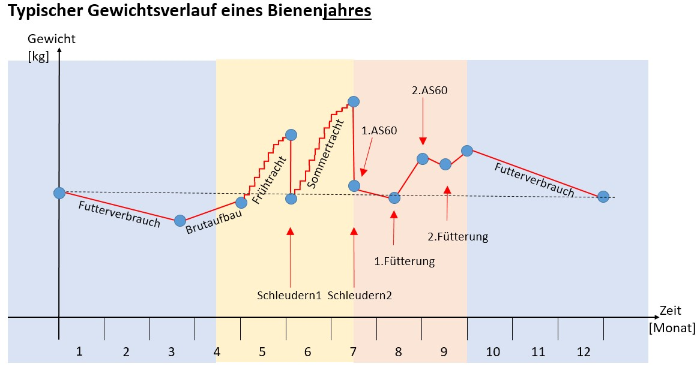
Natürlich ist der Verlauf stark von den individuellen Behandlungs-Konzepten des Imkers abhängig, weshalb in den Stockwaagendiagrammen an jedem Änderungspunkt die entsprechende Massnahme markiert ist, um den Kurvenverlauf besser interpretieren zu können. So würde eine totale Brutentnahme im Sommer nach der letzten Schleuderung einen deutlich anderen Spätsommerverlauf haben; ebenso eine 3. Schleuderung bei Spättracht-Imkerei.

Spätestens bei der letzten Einfütterung und Einwinterung sind aber wieder alle Verläufe gleich zu erwarten.
Der tageweise Honigeintrag der Früh- und Sommertracht ist, wie aus dem oben dargestellten Tagesverlauf abgeleitet, durch den Treppenverlauf markant zu erkennen.

Ebenso auffällig sind die Ruhephasen eines Volkes nach/während der AS Behandlung. Diese werden aber teilweise durch die allgemeine Volksumstellung auf Winterbrut überlagert.

###Ereignisse
Sonderereignisse wie
+ Schwarmabgang
+ Schneefall
+ Plünderung/Diebstahl (:()
+ Ggfs. Räuberei

sind in Abweichung zu den erwarteten Referenzverläufen ebenfalls unter Berücksichtigung der akt. Wetterlage erkennbar. 

In der Regel reicht die Stockwaage nur an einem Referenzvolk pro Standort um Globalereignisse wie der richtige Schleuderzeitpunkt für alle Völker am Trachtende zu ermitteln.

Im Weiteren stelle ich nun die Funktionen der Stockwaagemodule vor.

## Das Modul-Konzept
Dieser Aufbauvorschlag besteht im Kern als Mini-Compute Node aus einem Raspberry Pi für den Ablauf das Logger Programms, einer (!) Bosche Wägezelle zur Gewichtsmessung und diverse OneWire Sensoren für verschiedene Temperaturmessungen sowie weiterem Mess-Zubehör.

Der Compute Node wird über einen Mini-USB Port mit Strom versorgt. Ein LAN Kabel dient zur Kommunikation und liefert über POE (Power over Ethernet) den zentralen Stromzugang.
WLAN ist daher nur optional per 2. USB port vorgesehen.

Als redundante Stromquelle zum POE dient eine Lithium-Batteriespeisung mit Ladung einerseits über POE oder alternativ über ein externes PV Falt-Modul. Dieses erlaubt damit auch den mobileren Einsatz.

Die Messdaten werden über alle Sensoren erhoben, in Datentabellen auf dem Raspberry abgespeichert und per FTP zur Darstellung und/oder Auswertung z.B. an eine Web Page übertragen.
Parallel zu dieser externen Ablage stehen die Webpage files auch über den lokalen Webserver des Raspberry selbst zur Verfügung.
Neben der einfachen Messdatensammlung dienen diverse Algorithmen zur Plausibilisierung der Messwerte und statistischer Aufbereitung für das Tages-, Wochen- und  Monats-Mittel, welche damit ebenfalls als Diagramm aufbereitet dargestellt werden können.


##IoT für Bienen
Der obige Fat-Client Ansatz dient als POC - ProofOfConcept für alle Sensor-Algorithmen und grundsätzliche (Ver-) Messbarkeit von Vorgängen in einer Bienenbeute.

Deutlich eleganter und damit skalierbarer ist der Modulstack im IoT Aufbau:


Die eigentliche Aufgabe der Sensorsteuerung und Roh-Messdatenaufnahme kann auch mit einer Arduino kompatiblen MCU (ESP32, XMC, ...) geleistet werden:

**Vorteile:**
+ geringerer Stromverbrauch pro Sensorclient Modul
+ geringere Invest-Kosten
+ übersichtlichere Programmstruktur durch entzerrten Modulstack
+ Skalierbarkeit durch standardisierte Schnittstellen 
	- -> eine gesicherte Übertragung ist leichter realisierbar
+ Dadurch sind nahezu beliebig viele Sensor Clients in Reichweite verwaltbar.

**Nachteile:**
+ eine weitere Instanz zur Datenaufnahme
+ Mindestens 2 neue zu sichernde remote Kommunikationskanäle (NB-IOT/LTE + REST/Cloud service)
+ Dadurch höhere Kosten für mehr Remote Übertragungswege (-Verträge)

Grundsätzlich dient das Edge Device zur Registrierung und Kontaktierung der Sensor Clients via MQTT. Dabei findet eine  Konsolidierung der Rohdaten auf das wesentliche zur Übertragung an einen Cloud-/Web Service statt.
Erste Plausibilitätschecks und Tag-/Monat-/Jahres-Statistiken können ebenfalls erstellt werden.
Denn dafür reicht die Power eines Raspi Zero o.ä. bei Weitem.

Dies als Ausblick für die noch im Bau befindliche v2.0 Verion. Die Sensorlogik und Dateninterpretation zur Völksführung ist aber weitgehend synonym zur v1.x Version.

**Im Weiteren wird aber einfachheitshalber nur die Betriebsweise anhand des *Fat-Client Modells* beschrieben.**

## Die Sensorik
Als Sensoren werden folgende Elemente und Anschlüsse verwendet:
+ Wägezelle	-> über einen SPI-A/D Wandler HX711 an die GPIO Ports des Raspberry angeschlossen.
+ 3 Temperatursensoren zur Messung der
	- Stocktemperatur (innerhalb der Beute)
	- Externen Temperatur
	- Wägezellen Temperatur (ggfs. zur Kompensation einer Temperaturdrift)
	- => Alle Temp. Sensoren sind über das OneWire Protokoll direkt an den GPIO4 Port des Raspi angeschlossen.
	- Messung des Batteriespannungspegel
+ Optional
	- xternes IR-Kameramodul -> Bienensitz im Winter

###Die Wägezellen – Auswahl
Eine Standardwägezelle mit geringer Temperaturdrift und hoher Gewichtsstabilität sowie Messwiederholgenauigkeit weist heutzutage typischerweise vorkalibrierte Dehnmesstreifen in einer Wheatstonebrücke verschaltet auf. Diese ist eine gegenläufige Verschaltung von 4 Dehnmessstreifen (DMS) im Rautenmodell auf (siehe Schaltbild weiter unten) incl. Temperaturdriftkompensation.
Meine Auswahl fiel (wie bei so manchen anderen Waagen-Projekte im Netz auch) auf den Hersteller Bosche. Die Wägezelle muss folgenden Anforderungen entsprechen:
+ Mssbereich 100Kg (Waagedeckel + Beute (2 Brut- und 2 Honig-Zargen) + Deckel und Abdeckgewicht.
+ Sabile Verschraubung des Waagedeckels (für Zander: 40 x 50cm) mit dem Unterboden
+ Dadurch geringe Eckgewichtslast-Fehler
+ Spannungsversorgung ab 5V (aus Raspi Versorgungsspannung)
+ Großer Temperaturmessbereich -30 … +50 Grad
+ bei vorgegebener Genauigkeit: Class C3: 2mV/V
	- Bei  5V Messzellenspannung ergibt das eine Messabweichung von
(100kg/5V)*2mV => +/- 40Gramm
+ Wasserfestigkeit IP65 (spritzwassergeschützt)

Daher fiel die Wahl auf die: **Bosche H40A Wägezelle** mit den Eigenschaften:
+ Nennlast 100 kg
+ Kompensierte Eckenlastfehler
+ Für Dauereinsatz geeignet
+ Bezug direkt über den Bosche Shop: http://www.bosche.eu
+ Material: Aluminium
+ Genauigkeitsklasse bis C4 (C3 Standard, C4 auf Anfrage), Y=15.000, Nennwert-Toleranz: 2,0 mV/V
+ Eichfähig nach OIML R60 bis 4000D, Prüfscheinnummer: DK0199-R60-12.19
+ Aufbau: Das Messelement ist vergossen, Schutzklasse: IP65
+ Max. Plattformgröße: 500 x 500 mm
+ Stromversorgung: 5 – 12V
+ Temperarturbereich: - 30 ... + 70 °C
+ Anschluskabel: 1,8m
+ Preis: 58€

Anfangs habe ich mit dieser wesentlich günstigeren Wägezelle gestartet: --YZC161E-- (ca. 4,50€/Zelle)
Durch den Aufbau bedingt verkraftet diese Zelle aber nur 50Kg pro Zelle und ist baulich als Auflagesensor gedacht. Daher werden 4 Stück an jeder Ecke benötigt, die als Wheatstone-Brücke verschaltet werden müssen.

Wie aus dem unteren Bild (linke Hälfte) aber ersichtlich weisen die Auflagepunkte Reibung auf (je mehr Gewicht desto höher), die bei einer horizontalen Temperatur-Ausgleichsbewegung der Stabilisierungsträger Verspannungen hervorruft, und somit die Messzelle und damit die DMS vorspannt und zu starken Messfehlern führt.
Besonders unangenehm ist das „Springen“ der Auflage über den Messzellenauflagepunkt ab Überschreitung einer max. Spannung, was wiederum zu Messwertsprüngen führt. Diese lassen sich auch über eine Messzellen-Temperaturmessung nicht mehr verlässlich kompensieren.
Diese Wägezelle eignet sich vorrangig für Körperwaagen, wo i.d.R. nur Einzel-Messungen mit Rücksprung auf Null Gewicht erfolgen. Für konstante Dauermessungen auf höherem Gewichtsniveau eignen sie sich nicht.

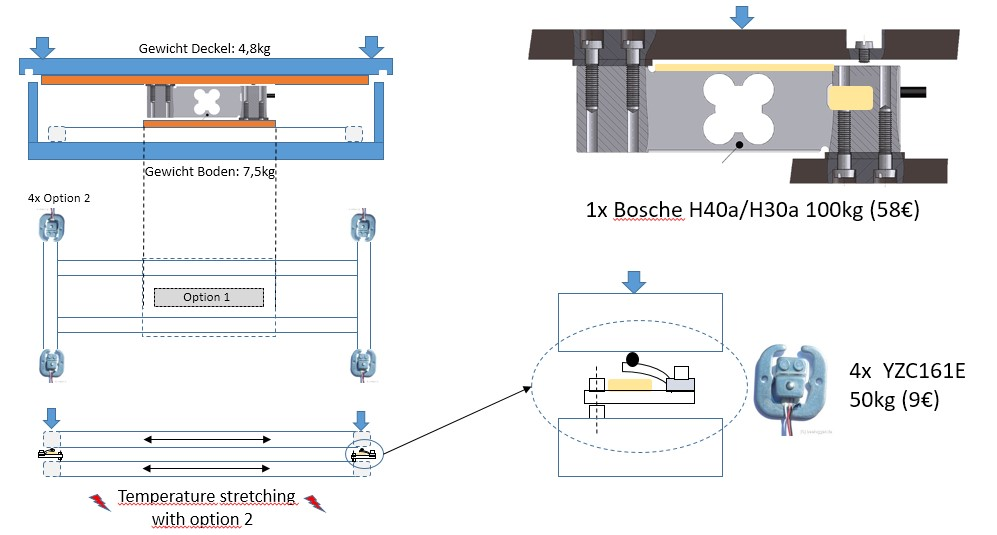

Daher habe ich diese zwar günstige aber aufwändig installierbare und nicht kalibrierbare Variante wieder verworfen.

Die Anbindung der **Bosche Wägezelle H40A** an den Raspberry PI (GPIO Ports) erfolgt über das 24bit A/D-Wandler Modul ‘HX711‘. Dieses wurde speziell für Wägezellen mit Wheatstone-Brücke konzipiert und weisst eine einstellbare Verstärkung und integrierte Referenz-Spannungsversorgung auf.
Beim Kauf ist darauf zu achten, dass die Module an den Anschlüssen E- bzw. BLK mit GND verbunden sind, was sich sonst in einer geringeren Temperaturstabilität und Meßstreuung auswirkt. Im Zweifel muss die Draht-Brücke selbst durch einen externen Draht nachgearbeitet werden.
Module mit grüner Schutzfarbe sind aber i.d.R. richtig beschaltet.
Desweitern werden die Wägezellen durch ihre Anzahl an Dehnmessstreifen (DMS) mit einer Wheatstonebrücke versehen. Ein DMS wandelt eine Gewichtsbelastung an einer Körperoberfläche in Widerstandsänderungen der Größenordnung Faktor 0,0001 – 0,001 eines Referenzwertes von ca. 400 Ohm um. Diese sehr geringe Änderung ist durch eine Messbrücke nach Wheatstone zu vermessen, welche durch ihre gegenläufigen Widerstandspaare temperaturstabilisierend und messverstärkend wirkt.
In der Bosche H40A sind die DMS derart verschaltet, dass das Ausgangssignal direkt auf den A/D Wandler HX711 geführt werden kann, was den Aufbau stark vereinfacht.

###AD Wandler HX711
Der AD Wandler HX711 ist für die Messung von Wheastonebrücken optimiert und bietet dazu 4 Anschlüsse E+/- + A+/-. An den Pins B+/B- liegt die Messspannung für die Waagzellenbrücke an. In unserem Fall die 5V von der Raspi Hauptstromversorgung.

Auf der rechten Seite befinden sich 4 Anschlüsse zur digitalen Anbindung an die GPIO Ports:

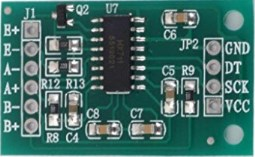

Die Eigenschaften des HX711:
+ 2 wählbare Eingänge zur Differenzmessung
+ Ein On-chip active rauscharme Steuereinheit mit wählbarer Verstärkung (32, 64 und 128)
+ On-chip Stromversorgungskontrolle für die Waagzelle
+ On-chip Rest nach Einschaltung
+ Einfache digitale Anbindung
+ Wählbare Samplegeschwindigkeit (10SPS oder 80SPS)
+ Stromsparregler: normaler Betrieb < 1.5mA, Off Mode < 1uA
+ Spannungsversorgungsbereich: 2.6 - 5.5V
+ Temperaturbereich: -40 - +85?

Zum Anschluss des HX711 SPI Ports an den Raspi werden nur 2 der GPIO Ports benötigt (SPI1: Data + SClk). Um eine möglichst stabile und störungsfreie Stromversorgung auf den 3.3V (digital) und 5V (Analog-) Schiene zu haben werden je 1x 100nF Siebkondensatoren sowie je ein 4,7uF Puffer-Elko verwendet.
Zur Abwägung des Stabilisierungsaufwandes dient folgende Genauigkeitsbetrachtung:

+ Gegeben: Speisespannung der Wheatstonebrücke von 5 Volt und einer Nennwert-Toleranz von 2mV/V (Class C3)
+  Bei  5V Messzellenspannung ergibt das eine **Messabweichung** von (100kg/5V)*2mV => **+/- 40Gramm**
+ Und eine **Empfindlichkeit** von 5V * 2mV/100kg = 0,1mV/kg

Der verwendete A/D Wandler darf somit eine maximale Schrittweite von 1 µV (entspricht 10Gr) haben. Das Bedarf einer sehr stabilen Referenzspannung und der A/D muss mind. 22Bit Auflösung haben (5V/2hoch22 = 1,2 µV). Damit ist der HX711 mit 24bit Genauigkeit also hinreichend.

###Temperatursensoren
Für den Anschluss von mehreren Messeinheiten über einen (3-pol.) Eingangsport bietet sich das serielle OneWire Protokoll an. Dafür steht eine große Palette an günstigen Sensoren zur Auswahl.
Für die benötigte Genauigkeit der Temperaturmessung wird der Sensor DS18B20 von Dallas verwendet, den es in der Bauform als 1,8m langes Versorgungskabel (3-pol.) und IP67 Abdichtung mit einer robusten Aluminium-Messspitze als Messsonde gibt.

Wie aus dem Bild ersichtlich, werden einfach alle OneWire Sensoren mit ihren 3 pol. Leitung parallel angeschlossen (es sind bis zu 10 Sensoren möglich). Zur Versorgungsstabilisierung der Datenleitung reicht ein Pullup Widerstand von 4.7k Ohm gegen 3.3V für alle angeschlossenen Sensoren.

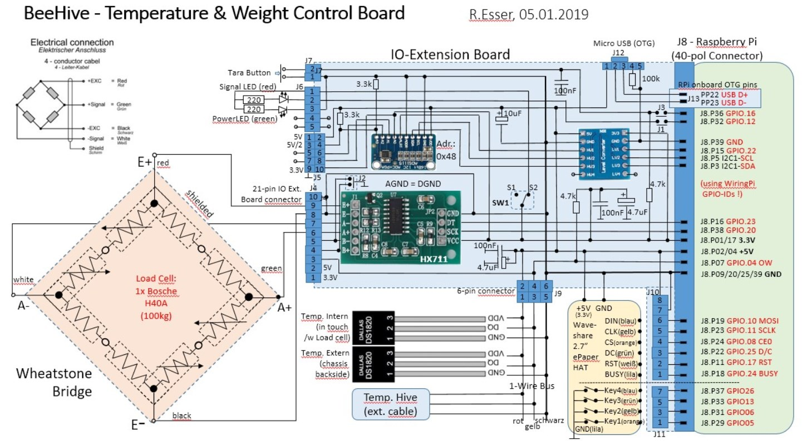

Über einen externen Stecker könnten noch weitere Sensoren angeschlossen werden.


###LED-Status Anzeige
Zur Anzeige der Spannungsversorgung Status (An/Aus) wird eine grüne LED verwendet.

Eine rote LED kann über einen GPIO Port getrennt angesteuert werden und durch Blinkcodes aus dem Programm verschiedene, Zustände anzeigen. Per default wird die Messzeit der Wägezelle durch LED(rot)=An angezeigt.

##Das Logger Modul
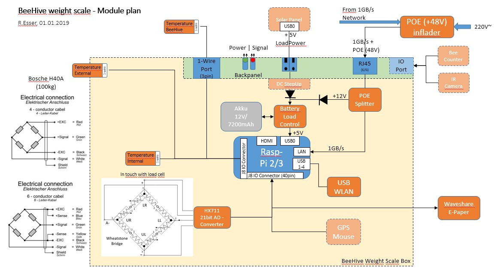
Das vollständige Übersichtsbild der Stockwaagenmodule zeigt die Vielfalt der verwendeten Techniken, aber auch das Potential in Sachen Spannungsversorgung und Sensorik:

+ Spannungsversorgung
	- USB 5V direkt extern + optional über einen Spannungsanheber (StepUp) an Batterielader
	- Lithium Batterie intern mit Ladekontrollmodul
	- LAN-POE mit POE/LAN Splitter
	- PV Modulanschluss extern
+ Kommunikation
	- USB WLAN Adapter
	- RJ45 LAN Port 100Mbit/s + 48V POE
+ Sensorik
	- 100kg Wägezelle über einen 24bit A/D Wandler Modul HX711(am Raspi GPIO Port Anschluss)
	- OneWire Temperatur internal Sensor an der Wägezelle
	- OneWire Temperatursensor extern
	- OneWire Temperatursensor extern für Stocktemperatur Messung (über 1m Leitung)
+ Optionale Erweiterung
	- USB GPS Maus (als Diebstahlschutz)
	- IR Kameramodul extern (USB oder Raspi GPIO Port Anschluss)
	- IR Lichtschranke als Fluglochzähler (beecounter)


##Stromversorgungsoptionen
Als größter und wichtigster Stromverbraucher gilt der Raspberry Pi 3 B+ mit ca. 500mA/h an 5V.
Von dort werden alle weiteren Sensorspannungen abgeleitet und verteilt (via 40pol. GPIO Port).

Diese 5V können über viel Wege bereitgestellt werden.

###Externer USB Port
Der direkteste und einfachste Weg ist natürlich direkt über einen externen USB Port als Ladeanschluss (max 1A möglich).

**Vorteil:** einfach und günstig über ein USB Ladegerät bereitzustellen. 
**Nachteil:** Die Reichweite ist zur Vereidung von Stör-Strahlungseinflüssen auf wenige Meter beschränkt. –> erfordert einen wetterfesten Netzanschluss „in der Nähe“ (ev. ideal für die Heimgartenlösung).

###Batterie
Als ladbare Batterie kämen in Frage ein

+ Gel/Blei Akku
	- Positiv: 	günstig im Einkauf
	- Negativ:	hohes Gewicht und Volumen
+ Lithium Akku
	- Positiv: 	Hohe Energiedichte -> geringes Volumen und Gewicht
	- Positiv:		lange Haltbarkeit der Ladung
	- Negativ:	sensibel bei niedrigen Temperaturen
	- Negativ:	hoher Preis

Zum Einstieg habe ich mich für einen 7.2AH/12V Gel/Blei Akku von Panasonic entschieden: 
LC-R127R2PG1 für ca. 20€.
Damit sollte eine Laufzeit ohne Nachladung von ca. 2 Tagen möglich sein. Das müsste aber noch im Vollausbau getestet werden.

###POE per LAN Port
Das POE (Power over Ethernet) Verfahren sieht eine externe Einspeisung von 48V in das Cat 5/6 LAN Kabel vor, sowie einen internen Splitter, der die 48 V vom LAN Signal trennt und in eine interne Versorgungsspannung (24V/12V/9V/5V) Zielspannung wandelt. Dadurch ist sowohl eine hochwertige Kommunikation als auch eine sichere Spannungsversorgung über große Distanz (30-50m) über nur ein Kabel möglich.

Für eine direkte Versorgung per mini USB Stecker am Splitter habe ich die direkte Zielspannung von 5V verwendet. Diese kann direkt an der Raspi angeschlossen werden.

Eine POE Lösung (Einspeiser + Splitter) für ein 100Mbit/s Signal ist für 20€ zu haben:

**Der Einspeiser:**	Danitech: Adapter PoE 48V 0,5A / 500mA 802.3af 24Watt RJ45 (10,50€)
**Der Splitter:**  	DSLRKIT Active PoE Splitter 48V to 5V 2.4A Micro USB Plug (8,90€)

Mit interner Batterie und Lademodul ist eine höhere Splitter-Spannung von >12V nötig um dem Ladregler einen Arbeitsbereich für eine ausreichende Ladespannung von ca. 13,5 - 14,5V zu ermöglichen. Ideal wäre somit ein 48V -> 16-24V Splitter mit möglichst hoher Leistung.
Denn der Laderegler + Batterie nehmen jede Energie, die sie „kriegen“ können. Legt man die Einspeiser/Splitter Kombi zu schwach aus, bricht die Spannung ein und der Betrieb ist instabil.

Ein Ladestrom von 1,5-2A sollte möglich sein, was bei 16V Splitterausgangsspannung ca. 30W Leistung benötigen würde. Der Einspeiser müsste bei 48V aber nur 0,7A liefern.
Das kombiniert mit der Option von bis zu 1GBit/s LAN Durchsatz ergibt das Angebot
```
Ubiquiti 	POE-48-24W-G Netzwerk/Router 	(17,98€)
```
Oder hochwertiger:
```
Intellinet 	PoE Injektor (1 Port, 48 V DC, IEEE 802.3af kompatibel) schwarz 524179 (29€)
```
Leider ist es bei den POE Splittern schwieriger:

Ich habe auf die Schnelle nur folgendes Model im Preisrahmen gefunden:
```
802.3af to 24 Volt GigaBit PoE Splitter for Ubiquiti and Mikrotik
from PoE Switches with 24 Volt 15 Watts Output WT-AF-24v15w (16,95€)
```

###PV Modul
Nicht zuletzt die mobile Lösung durch ein externes PV Modul/Panel:

	Solar Charger RAVPower 16W Solar Panel für 46€ (23.9 x 16 x 2 cm)

Die Besonderheit liegt in der hohen Dynamik der Energieversorgung durch wechselnde Sonneneinstrahlung, weswegen ein nachgeschalteter interner Laderegler via Batterie die Energie puffert und in die gewünschte Zielspannung umsetzt. 
Auch hier ist das Spektrum sehr groß, von einem 180W Panel 1,8m x 0,8m Größe bis hin zu einem 40W Faltpanel, teilweise gleich mit Micro USB Kabel Anschlüssen.

Auch hier müssen wir eine Lösung finden die im Schnitt >16V liefert und mit ausreichender Leistung.
Diese sind häufig im Campingbereich zu finden als Kompromiss zw. Mobilität und Leistung.

In unserem Fall wäre es kein großes Problem ein kleines Panel neben die Beute zu platzieren.
Im Winter läuft man allerdings Gefahr, dass der Schnee zu lange die Energieversorgung ausbremst und die Batterie leerläuft.

###Batterie Laderegler
Die Energieverwaltung/Verteilung durch zeitgleiche Ladezyklen und Verbrauchsphasen soll über ein eigenes Ladekontrollmodul erzielt werden.  

Erste Versuche habe ich mit dem **PV Solar Panel MPPT Laderegler von Sunix** gestartet: 


	Modell: SU-SU702  (CMTD 2420) / 10A mit den Maßen: 14,4 x 8,3 x 4,1 cm für 13,99€


Er hat die interessante Zusatzfunktion neben jeder Eingangsspannung bis 70V und der Batterieausgangsspannung zw. 12-14.3V auch 2 Standard USB Ports anzubieten mit geregelten 5V.
Diese würden direkt für den Betrieb des RaspberryPi herhalten können.

Die Kennwerte dieses Moduls sind:
> Nennspannung : 12V / 24V (Auto-Switch)
> Max. Lade / Entlade-Strom : 10A
> Max. Solar-Panel Eingangs-Spannung : =50V
> Stop-Ladespannung : 14.7V / 29.4V
> Nieder-Voltage-Wiederherstellung : 12,2 V / 24.4V
> Nieder- Spannungsschutz : 10.5V / 21.0V
> USB-Ausgangs-Spannung / Strom : 5V 2A
> Kein- Lade-Verlust : =10mA
> Temperatur Kompensation : -3mV / Cell / ° C
> Betriebs-Temperatur : -20 ° C ~ 60 ° C

Mit folgenden Schutzmassnahmen:
1. Überlastschutz
2. Kurzschlussschutz
3. Blitzschutz
4. Unterspannungsschutz
5. Überladeschutz
6. Verpolschutz

Mit diesem Laderegler ist es möglich die Batterie-Beladung durch unterschiedliche Stromquellen über Dioden zusammengeführt zu konfigurieren, während ein Verbraucher parallel versorgt wird (können viel Batteriepacks nicht: nur Laden oder nur Liefern).
Bei dem oben aufgeführten 16W Solarpanel habe ich den 5V Wandler der USB Ports umgangen und direkt eine Ableitung von den Panels angelötet. Dadurch erzielt man Spannung zw. 0…25V, was en Wirkungsgrad des Ladereglers erhöht.

Bei einem trüben aber freundlichen Märztag war eine Ladespannung von 14,6V über mehrere Stunden gegeben. Tests bei Vollsonne stehen noch aus…

Über 2x BY500 Dioden lassen sich weitere Stromlieferanten am Eingang einpflegen.
Für die Kontrolle der Pegel einer jeden Spannungsquelle (3.3V, 5V, 12V usw.) wurde ein 4-Kanal 16Bit A/D Wandler ADS1115S mit SPI Anschluss vorgesehen.
Für die eigene Versorgungsspannung Vcc= 5V des Converters habe ich 5V gewählt um ein größeres messbares Spannungsfenster an den AnalogPorts verfügbar zu haben: 0V – 4,096V -> 1mV / Step .

Die 3.3V GPIO Pegel werden über einen duplexfähigen Level Converter per Datenleitung auf 5V Pegel umgesetzt.

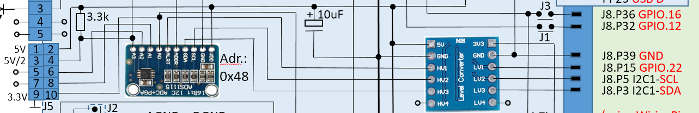

Zur Stabilisierung der 5V Linie habe ich noch einen 10uF Kondensator spendiert.

Über 2x 3.3kOhm Widerstände werden am AnalogPort 3 ein Spannungsteiler zur Messung der (eigenen) 5V Spannungsversorgung ermöglicht. Ähnlich müsste man bei größeren Spannungsquellen verfahren die >4V liegen.


##Der Aufbau
+ Das Rahmenwerk besteht aus einer Edelstahl Vierkantrohr-Konstruktion
+ Das Compute Node Modul ist in ein wasserdichtes Gehäuse der Schutzklasse IP67 eingebaut
+ Kabelanbindung mit Nagetierschutz
+ Messbereich: 0..100kg mit +/- 30 Gramm Genauigkeit und extrem geringer Temperaturdrift
+ Start der Messung und Übertragung automatisch beim Einschalten
+ Einfache Konfiguration auf Basis remote erreichbarer (Windows & Linux) Konfigurationsdatei (config.ini)
+ Alle Kabel werden an das Gerät durch wasserdichte Kabelverschraubungen angeschlossen. 
+ Alle angeschlossenen Sensoren sind auch wasserdicht, Schutzklasse IP-66 oder IP-67.
+ Der Gehäuseaufbau erlaubt das einfache Anpassen der Auflagefläche durch massgerechte Unterlegplatte für jede Beutengröße verwendet werden.
+ Nachkalibrierung durch einfachen Tastendruck am Gehäuse möglich

###Stückliste

| Index | Stück | Bezeichnung | Hersteller | Bezugsquelle | Preis | Kommentar |
|-------|-------|-------------|------------|--------------|-------|-----------|
|1|1|Plattformwägezelle H40A-C3-0100|Bosche|http://www.bosche.eu|58€|H30A v H40A 100kg|
|2a|1|Raspberry Pi (B v B+)|OSS|Amazon|35€|(v2 oder v3)|
|2b|1x|SD HC Karte 8GB|||Amazon|5€|
|3|1x|HX711 24 Bit A/D Wandler||Amazon|10€|Grüne Lackschicht!|
|4|2x|Montageplatte für Wägezelle Eisen oder Inox 100 x 180 x 8mm|Schlosserei||30€|Keine Beschichtung|
|5|4x|Inox 4-kant Rohr 30x30x450|Schlosserei||60€|1,5mm stark, mit #6 in H-Konstruktion verschweisst|
|6|4x|Inox 4-kant Rohr 30x30x200|Schlosserei||60€|1,5mm stark, mit #5 in H-Konstruktion verschweisst|
|7|1x|IP67 Montagebox|Maße ?||Amazon||
|8|3x|Temperatursensor DS18S20|Dallas|Amazon|7,5€|Mit 1,1m Kabel|
|9|2x|MSP Siebholzplatten 520x410x10mm |Baumarkt|Baumarkt|36€||
||2x| 520x60x10mm|Baumarkt|Baumarkt|||
||2x| 410x60x10mm|Baumarkt|Baumarkt|||
|10|8x|M8 20mm Senkkopfschrauben|Baumarkt|Baumarkt|16€||
|11|8x|M10 20mm Senkkopfschrauben|Baumarkt|Baumarkt|20€||
|12|16x|M5 20mm Senkkopfschrauben|Baumarkt|Baumarkt|10€|Verbindung der 2 H-Rahmen mit dem Holzgehäuse|
|12|1x|POE Einspeiser & Wandler 1Gb/s & POE 48V->5V||Amazon|15€|1Gb/s & Mini-USB|
|13|div.|Litze D:1mm ca. 3m||Amazon/Conrads|10€|Sensorverdrahtung|
|14|1x|Alu/Kunststoff-Platte 120x45x1,5mm||Amazon|8€|Anschlusspanel|
|15|1|RJ45 1Gb/s wetterfeste Durchführungsbuchse||Amazon|10€|Für LAN & POE Anschluss|
|16|1|5-pol wetterfeste Durchführungs Rundstecker & Buchse||Amazon|5€|Für ext. OneWire Sensoren|
|17|1|LAN Kabel Cat6 Outdoor 10-30m||Amazon|20-40€|Länge nach Erreichbarkeit des Switch|
|18|1|Elektr. Epoxid Experimentierplatine mit Rundlöchern (einseitig)||Conrads/Amazon|5€|Zum Verbinden der 40-pol. GPIO Leiste mit HX711 und OneWire Bus|
|19|1|Sub-D 25-pol. Stecker & Buchse||Conrads/Amazon|5€|Zum Durchführen der HX711 und OneWire Bus-signale am RPI Gehäuse|
|20|1x|4-channel Level Converter für 3V <-> 5V Pegel,  bidirektional||Amazon|4€||
|21|1x|A/D Converter ADS1115S||Voelkner|5€|4-fach 16Bit A/D Wandler mit I2C API zur Versorgungs-Spannungsmessung|
|22|1x|ePaper Display 2in7 von WaveShare 264x176 pixel 3.3V||Amazon|25€|Extrem stromarmes S/W Display 2,7 Zoll mit SPI Interface|
|23|1x|Micro USB Buchse||Amazon|2,50€|Zur opt. USB basierten Erweiterung des Raspi Zero W|
|24|1x|100kOhm 0,25W Widerstand||Voelkner|0,10|Pullup für USB Port am USB-ID Pin|
|25|1x|10-polige Steckerleiste|Printmontage|Amazon|1,50€|Stecker für die 4  ADS1115S Analog Ports|
|26|2x|8-polige Steckerleiste Printmontage||Amazon|1,50€|Stecker für das ePaper 2in7 API + 4 Tip-Schalter|
|27|2x|3.3kOhm Metallfilm Widerstand 1/4W||Voelkner|0,10€|Als Spannungsteiler am Analogport 3 des ADS1115S|

##Das Aussengehäuse

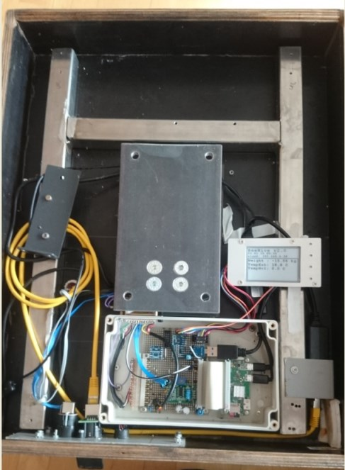

Hier sieht man schematisch im Querschnitt die Auflagekonstruktion der Wägezelle.

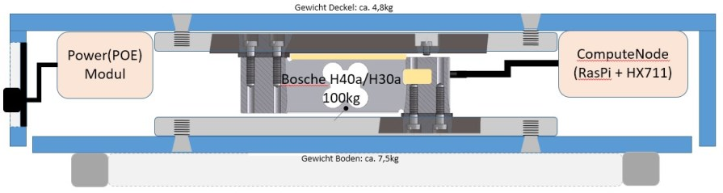

Der damit verbundene Deckel + Compute Node + Power Module schwebt über dem Bodenelement und liegt samt komplettem Beutengewicht ausschliesslich auf den etwa 16cm2 Fläche der verschraubten Wägezelle auf. Dies erreicht man über 6-8mm starke Zwischenbleche jeweils an der oberen und unteren Verschraubung der Wägezelle, die je mit 4x M10 Senkkopf-Schrauben fixiert ist.

Steht die i.d.R. 50-70kg schwere Beute auf der Waage schwankt sie recht steif über der Bodenplatte. Dies ist ein Zeichen dafür, dass das Waagzellen Element aktiv die Kraft aufnimmt und nirgends aufliegt.

In der Rückwand ist das Anschlusspanel eingearbeitet und sowie die notwendigen Aussenanschlüsse. 
Das E-Paper Panel ist in die linke Seitenwand eingesetzt worden.

###Das Anschluss Panel
Das Gehäuse Panel ist der einzige Anschlussbereich nach Aussen. Daher werden dort wasserfeste Stecker-Kombinationen eingesetzt: LAN Anschluss (1GB/s mit POE 48V), 5 pol. Externer OneWire Sensor Connector für den Bienenstock Temp.Sensor + ev. weitere Optionen.

Als Träger dient eine korrosionsbeständige eloxierte ALU Platte (1,5mm). An dieser lassen sich die Buchsenlöcher gezielt herausarbeiten; sie trägt aber nicht so stark auf wie eine Holzplatte.

Als Letztes findet sich dort der Taraschalter (der über die config.ini Datei enabled/disabled werden kann). Dieser wird gedrückt, wenn noch keine Beute aufliegt, aber ev. eine Erweiterungsplatte o.ä. eingesetzt wird. Danach wird der Kalibrierungswert für den Sollwert: 0kg automatisch neu eingestellt (das Eigengewicht des Waagendeckels + Zubehör wird sozusagen herausgerechnet)
Auch können darüber Beuten-Deckelgewichte abgezogen werden (ohne Beute auflegen und Tara Taste drücken -> 0kg sollten beim nächsten Messzyklus ausgewiesen werden).
2 LEDs zeigen schliesslich die Betriebszustände der Stromversorgung (grün) und die Messaktivität (rot) an (rot = Messaktivität läuft). 
Die Aussenansicht:
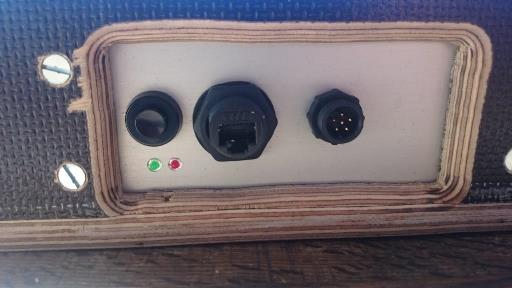

Die Innenansichten der Anschlussstecker
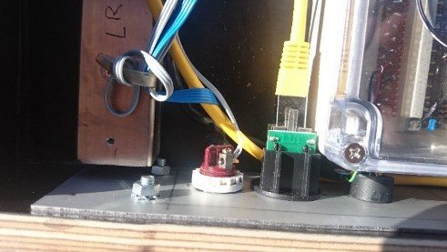
und der E-Control-Box
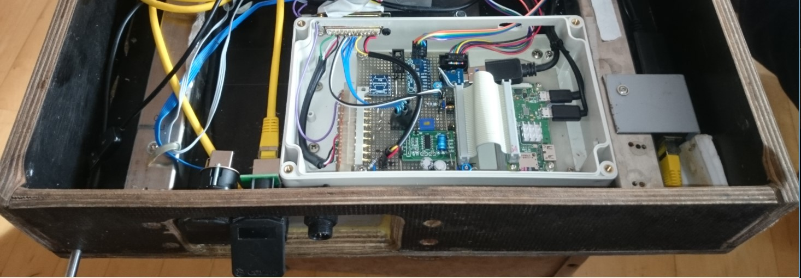


###Die Bosche Wägezelle 
(Einbau als Single-point Wägezelle)
Die Wägezellen von Bosche für Plattformwaagen gibt es in 4- oder 6-pin Ausführung. 
Beide sind funktionell gleichwertig:

 

Hier kommt die übliche Wheatstone-Brücke zum Einsatz, die die beste Temperatur-Kompensation bei hoher Messgenauigkeit bietet. Die Temperaturkalibrierung an den Dehnmesstreifen wurde werksseitig schon vorgenommen. Ggfs. bei Temperaturen < -5Grad kann noch eine rechnerische Kompensation softwareseitig überlagert werden und sinnvoll sein.

Der Einbau gestaltet sich sehr einfach. Einzig die Fixierung der jeweils 4 Schrauben pro Auflagefläche muss sehr stabil und genau erfolgen. Hier setzt der Hebel des gesamten Beutengewichts samt Waagedeckel an.

Dazu die Auszugsbilder aus der mechanischen Applikations-Beschreibung:

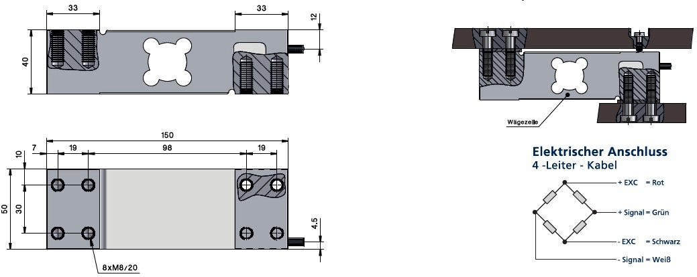

und die einfache Konstruktion, wie sie hier zum Einsatz kommt:

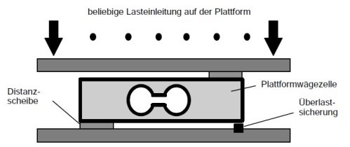

Die obere und untere Platte zur Kraftübertragung auf die Wägezelle sollte mind. 6-8mm betragen und idealerweise aus Edelstahl. Aus Kostengründen geht aber auch Aluminium. Dann aber besser mit 10mm Stärke. Die Plattenmaße betragen bei mir 12 x 18cm (darf aber auch größer sein).

Die Distanzscheiben betragen bei mir je 4mm und bestehen aus separaten kleinen Aluscheiben mit dem Maßen 6x6cm inkl. den benötigten 4 Bohrungen für die M8 Schrauben.
Die Bohrungen in der Platte sollte 1mm größer ausfallen als die Schraubenstärke und nach „aussen“ konisch durch einen Phasenschneider erweitert werden. Dadurch kann man die als Senkschrauben ausgelegten 2x4 M6-M8 Schrauben bündig abschliessen. Dies ist nötig um die Gehäuse-Deckel/Boden bündig auf die Platten zur bessern Kraftübertragung anzubringen. 

Die Überlastsicherung besteht aus einer M6 - M8 Gewindebohrung an der untern (oder oberen Platte) und einer Schraube, über die der Arbeitsbereich der Wägezelle eingestellt werden kann. Bei einer 100kg Wäge-Zelle erzeugt man ein Testgewicht von 110kg und man dreht die Schraube solange ein bis sie leicht an der Wägezelle aufstehen. Dadurch wird einer zerstörenden Verformung des Zellenkörpers vorgebeugt (z.B. wenn man sich auf der Beute abstützt bei aufliegendem vollen Honigraum).
An einer Seite schaut das 4/6 adrige Kabel heraus, welches zum A/D Wandler der Compute-Einheit führt.

Zuletzt wird die Platte durch weitere Gewindebohrungen mit kurzen M12 Schrauben mit dem Gehäusedeckel-/Boden verschraubt.

Hier nochmal das Lagebild der Wägezelleneinheit mittig zum Gehäuse:


###One Wire Sensoren
One-Wire Sensoren werden über 3 pol. Anschlüsse (Masse Gnd, Versorgungsspannung Vcc und Daten) parallel miteinander verbunden.

Durch das OneWire Bus-Protokoll können somit leicht mehrere Sensoren unterschiedlichster Art/Funktion hintereinander, an demselben Anschluss verbunden werden. Bei den Raspi GPIO Ports sind allerdings nur max. 8 Sensoren in Verbindung mit 3.3V Vcc in Kombination mit abgeschirmtem Telefonleitungen zu empfehlen.
Jeder Sensor hat dabei zur Erkennung eine einzigartige 64 Bit ID. Verwendbar sind die Sensoren an Spannungen mit 3-5V.

Glücklicherweise hat der Raspberry Pi Kernel intern bereits einen OneWire Driver Kernel Modul der das Protokoll wie vom Hersteller „Dallas“ spezifiziert beherrscht.
Die Störanfälligkeit ist gering dank rein digitaler Übertragung. Die Datenleitung benötigt dazu allerdings einen Pullup von 4.7k Ohm einmalig (!) von der Daten- auf die Vcc Leitung (unabhängig von der Versorgungs-Spannung!).

Neben den 2 internen Temperatursensoren habe ich über einen 7-poligen Stecker die OW-Busleitungen nach Außen zugänglich gemacht um weitere externe Sensoren zu ermöglichen.

####Der DS18B20 OW-Temperatur-Sensor
Der DS18B20 OneWire Sensor ist besonders praktisch für das Messen von Temperaturen in Wasser oder feuchten Umgebungen dank wasserdichtem 1,10m langem Kabel und der vergossenen 3 cm langen Metall-Messsonde.
Der Temperaturbereich reicht von -55 bis 100 Grad. 

Dieser OneWire-Digital-Temperatursensor ist sehr präzise (±0,5°C Genauigkeit von -10°C bis +85°C) dank einem internem vorkalibriertem 12Bit A/D Wandler und ist somit für unsere Messungen mehr als hinreichend.
Das wären 4096 Messteilwerte über den gesamten gemessenen Temperaturbereich.

**Verfügbare Ausführungen:**
+ DS18B20 Sensor im Edelstahl-Körper, 6mm Durchmesser, 30mm lang 
+ Kabellänge von etwa 90-110cm lang mit Durchmesser 4mm, unkonfektioniert

	**Sensor-Anschluss mit 4-adrigem Kabel:**
1. Rot:	 	3-5 V Anschluss, 
2. Schwarz:	Masse 
3. Weiß.		1-Wire serielles Datenprotokoll 
4. Die äußere Kupferader wird an die Drahtabschirmung mit dem Stecker/Gehäuse verlötet.

	**Sensor-Anschluss mit 3-adrigem Kabel: **
1. Rot:		3-5 V Spannung 
2. Blau / Schwarz: wird mit Masse verbunden 
3. Gelb / Weiß:	1-Wire Datenleitung

Weitere Links:
* [Dallas Temperature Control Library](http://www.milesburton.com/?title=Dallas_Temperature_Control_Library "Dallas TempControl Lib")
* [OneWire Library](http://www.pjrc.com/teensy/td_libs_OneWire.html "OneWire Lib")
* [Raspberry Pi: 1-wire Temperatursensor DS1820 ansteuern](http://www.einplatinencomputer.com/raspberry-pi-1-wire-temperatursensor-ds1820-ansteuern/)

Obwohl die Versorgungsspannung für 1-Wire-Devices normalerweise 5 V beträgt, ist beim Raspberry Pi die verringerte Spannung von 3,3 V nötig, weil dessen GPIO-Ports nur 3,3 V vertragen und durch höhere Spannungen zerstört werden.
Nachfolgende Bilder zeigen die verschiedenen Anschlussmöglichkeiten. Dabei werden die dargestellten Chipformen in unserem Fall in einer Metallhülse vergossen.

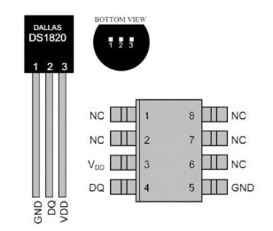 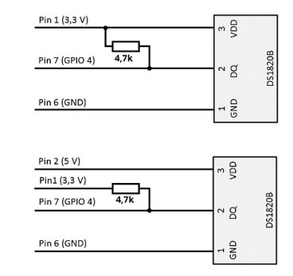

(Wie erwähnt: der Pullup Widerstand wird nur einmal intern angeschlossen.)

###Compute Node
Das Herzstück des Computnodes ist im Fat-Client Modell der **Raspberry Pi v3**.

Dieser sowie alle weiteren empfindlichen elektronischen Module wurden in eine IP67 dichte Box eingebaut. Das beugt Kondenswasserschäden vor. Widererwartens habe ich auch bei höchsten Aussentemperaturen kein Temperaturproblem am Raspi gehabt. Dies kommt wohl durch die Isolationswirkung der massiven aufstehenden Beute von Oben:

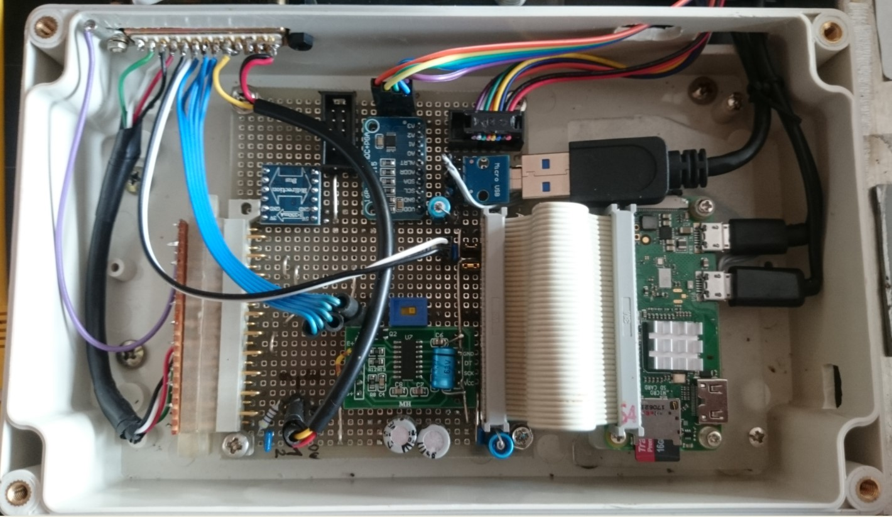

Zwischen dem Raspi und den Sensoren dient eine Lochrasterplatine als Verbinder und Träger der Umsetzungsmodule, wie dem HX711 A/D Wandler für das Wägezellenmodul, dem Level Converter & ADS1115S, sowie diverser Widerstände und Kondensatoren zur Leitungspufferung. (Details siehe Schaltplan).
Von rechts gesehen führt ein Mini-USB Stecker die 5V Versorgungsleitung in die Box an den Raspi. Dieser führt wiederum über seine 40-polige Stiftleiste die GPIO Leitungen zur Adapterplatine. Von dort führen mehrere Steckervarianten die Sensorleitungen zu einem extern 25-pol. Sub-D Stecker. Hierfür gibt es sicher noch elegantere Steckverbinder ev. incl. Abschirmung. Dieser Aufbau erwies sich aber als erstaunlich wenig störanfällig, trotz Ausseneinsatz und einer langen POE Zuleitung.

###Anschlüsse
Hier nun eine Übersicht aller verwendeten Steckervarianten:

+ Links:	Der runde 6-polige One-Wire Extension Stecker mit dem typ. 3 OW Bus Leitungen.
+ Mittig:	Der Zwischenstecker der Adapterplatine für alle verwendeten int. + externen Sensoren.
+ Rechts:	Der 25-pol. Sub-D Stecker ausserhalb der IP67 Computenode-Box

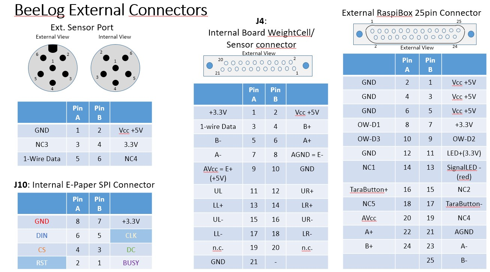

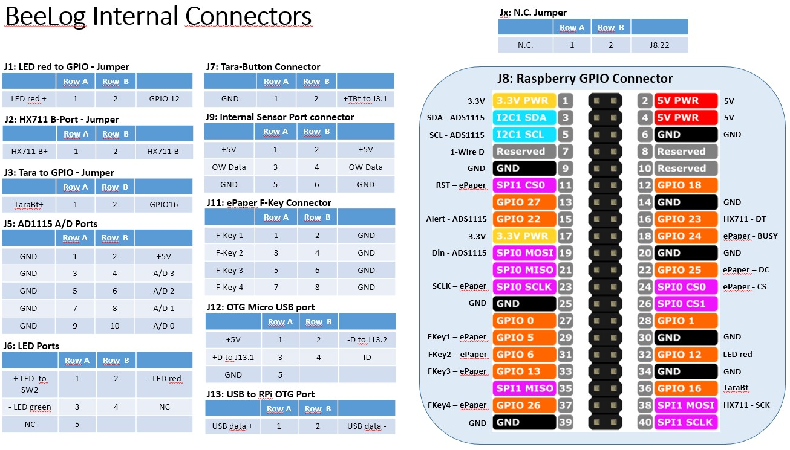

Die Adapterplatine mit Komponentenbeschriftung:

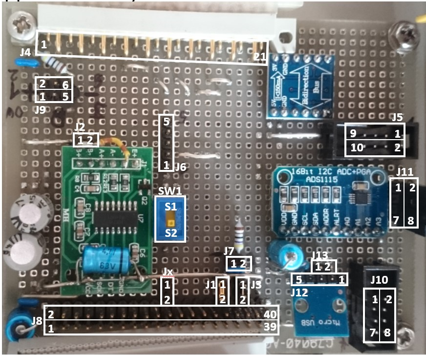


###Das E-Paper Display
Zur stromsparenden Darstellung der aktuellen Zustands- und Mess-Werte musste ein Display her.
Dadurch sieht man wesentliche Werte gleich Vorort und nicht nur über eine Webseite remote.

Als Kriterien gelten:
+ Stromsparend auch in der Wait-Loop Phase zwischen den Messungen
+ Gute Ablesbarkeit durch hohen Kontrast auch bei direkter Sonneneinstrahlung
+ Einfacher Anschluss an bestehende Raspberry Interface-Pegel: 3.3 / 5V 
+ Einfacher Ansteuerung und Kontrolle der Darstellung.

Zumindest die ersten 3 Punkte konnte ich durch das ePaper von WaveShare erfüllen: 
+ Waveshare 2.7 Inch E-Paper Display HAT Module Kit 264x176 Resolution 
+ 3.3v E-ink Electronic Paper Screen with Embedded Controller 
+ for Raspberry Pi 2B 3B Zero Zero W SPI Interface

Ein Stromverbrauch entsteht nur in der Ladephase der Darstellungsdaten. Größter Vorteil ist aber das passive Darstellungsmedium welches auch bei direkter Sonne wie ein gedrucktes Papier erscheint. Das erhöht die Lesbarkeit im Outdooreinsatz enorm.
Ein LCD Display müsste hier nachgesteuert werden und muss dazu dauerhaft mit Strom versorgt werden.

Das EPaper hat i.d.R. aber leider auch keine Hintergrundbeleuchtung. Dieses Modul weißt neben dem eigentlichen Display noch 4 universelle Schalter zur späteren funktionellen Erweiterung von z.B. verschiedenen Darstellungsebenen auf.

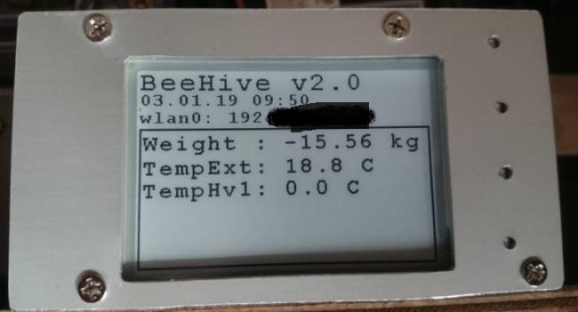

Als Anschluss steht ein separates SPI Interface über einen 8poligen Stecker incl Kabel zur Verfügung: 

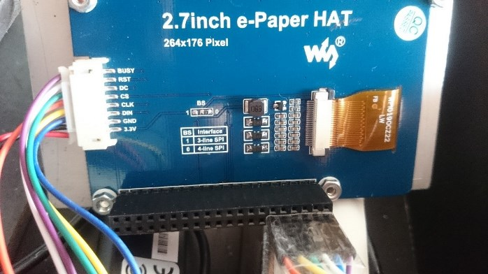

Die Anschlussbelegung des Kabelanschlusses:


|Pin|Function|
|----|--------|
|VCC|3.3V/5V|
|GND|Ground
|DIN|SPI MOSI pin
|CLK|SPI SCK pin
|CS|SPI Chip Selection, low active
|DC|Data(=1) / Command(=0) selector
|RST|Reset, low active
|BUSY|Busy status output, low active|

Für erste Testzwecke kann das gesamte Modul auch gleich auf den 40pol. IO Stecker des RaspberryPi gesteckt werden.
Den passenden und umfangreichen DemoCode von WaveShare für RaspberryPi in C++ findet man **[hier](https://www.waveshare.com/wiki/File:2.7inch-e-paper-hat-code.7z)**.

##Die Raspi Logger Software
Ab hier folgt nun eine Schrittweise Einführung und Konfiguration der Raspberry PI Einheit ab der SD Karten Erstbetankung bis zum Ablauf der Logger SW.

###Raspberry Pi Vorbereitungen
Wer sich noch nicht so sehr mit dem Raspberry auskennt, dem sei diese **[Einsteiger-Seite](http://raspberrypiguide.de/ "RaspberryPi Guide")** empfohlen.

In diesem Bauvorschlag wurde der RaspberryPi V3 verwendet, weil 4x USB 2.0 Ports zur standardisierten Erweiterung geboten werden (z.B. für USB WLAN-Dongle  oder USB-GPS-Maus, sowie alternative Stromversorgungen). Leider hat dieses Model einen deutlich höheren Stromverbrauch, weshalb nur ein zeitlich eingeschränkter Batteriebetrieb möglich ist.
Wer diese Optionen aber nicht benötigt, findet die benötigten GPIO Anschlüsse bei den kleineren Raspi-Modellen (A + B) auch wieder (wenn auch nicht auf einer GPIO Leiste). 
Die OS und SW Konfiguration sollte für alle Modelle gleich anzuwenden sein.

Physikalisch ist der Raspberry Pi wie folgt angeschlossen:
* Mini USB Stecker zur 5V Versorgung 
(vom Powermanagement Modul bzw. POE Adapter kommend)
* Der 40-polige GPIO Port Stecker J8 (weitere Details siehe Schaltplan):


Der GPIO Port für 1-Wire ist konfigurierbar über /boot/config.txt: dtoverlay=w1-gpio, gpiopin=4 (nach BCM GPIO Nummerierung)

Intern bietet der Raspi 3 noch ein Realtek WLAN Modul onboard.
Der Raspi2 oder Raspi Zero bieten das nicht, haben dafür aber den geringeren Stromverbrauch. Alternativ gäbe es den hier verwendeten „Raspberry PI Zero W“, mit WiFi onboard und besserer WLAN Antenne als der 3B.
Benötigt man dennoch einen WLAN Zugang -> muss man ansonsten noch einen 2. USB Port mit USB WLAN Dongle anschliessen (z.B.der  Minidongle von EMtec)

Tips dazu finden sich hier:
+ [USB WiFi Adapter](http://elinux.org/RPi_USB_Wi-Fi_Adapters)
+ [USB BlueTooth Adapter](http://elinux.org/RPi_USB_Bluetooth_adapters)

Hier die vollständige GPIO Stecker J8 Belegung, wie sie für alle Modelle ab v2 gültig ist.

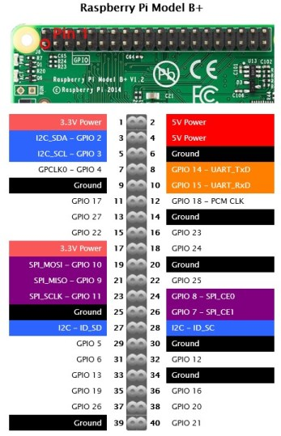

Die GPIO Nummerierung erfolgt hier nach dem Board internen BCM Chip Anschluss. 
== *Hinweis:* Auch mit der WiringPI library kann man über die passende Setup Routine *wiringPiSetupGpio()* weiterhin die GPIO Enumerierung verwenden !.==

Jeder GPIO Port darf allerdings nur mit **max. 50mA an 3.3V** belastet werden.
==Hinweis: Das Modell 3 des Raspberry Pi zieht mindestens 600 mA Strom und bei einer Spannung von 5V ergibt das einen Verbrauch von 3Wh. Das Netzteil sollte daher dauerhaft mind. 5W an 5V liefern können, um auf der sicheren Seite zu sein.==

####Raspi OS
**Nun kommen wir endlich zur Software Seite:**

Häufig kauft man das RaspberryPi im Paket mit einer fertig getankten SD Karte (für den Einsteiger zu empfehlen). Wer es selber machen möchte:

Auf die (empfohlene 16GB) SD Karte des Raspberry wird das Betriebssystem Raspbian Stretch (Debian V8 „Jessie“) aufgespielt.
Dazu ladet ihr das NOOBS-Image (ca 1,5 GB) herunter: **[RPi Download Page](http://www.raspberrypi.org/downloads)**

Unter Windows solltet ihr die SD Karte als Laufwerk bereits sehen. Sicherheitshalber über den Disk Manager die SD Karte neu mit FAT32 (Standard) formatieren (Quick format reicht).
Das NOOBS Image mit Winzip/7Zip o.ä. entpacken und alle Dateien auf die SD karte kopieren.
Danach diese einfach in den Raspi SD Slot einstecken. 

Anfangs wird eine USB Maus+Tastatur sowie ein HDMI Display für die Erstkonfiguration benötigt.
Nun das USB Ladekabel an den Mini-USB Stecker angeschlossen und los geht’s:

Der Raspi bootet nun in ein Konfigurationsmenü raspi-config:
+ Stelle die Zeitzone und Sprache ein
+ Zur Nutzung der vollständigen SD Karte unter Raspbian, wähle *expand_rootfs* aus und schreibt *yes* in die Konsole.
	- Das Board rebootet sich…

####Basiskonfiguration
Da der Raspi keinen Powerschalter besitzt, bootet er nach stecken des USB Steckers immer in die Konsole. Dort…
+ Gebt pi als Benutzernamen und raspberry als Passwort ein
+ Mit ‚df –h‘ könnt ihr nun die vergrößerte Rot Partition prüfen.
+ Starte raspi-config von der Konsole und setze die Erstkonfiguration fort
+ -> Change user Passwort
+ -> Enable Boot => Console
+ -> Internationalisation Options:
	- Locales: DE_DE.UTF8 oder En_GB.UTF8
	- Timezone: Europe – Berlin
	- Keyboard Layouts: 
		Modell = Generic 105-key (Intl-PC)
		Layout: German (eliminate dead keys)
+ Wer plant noch eine Kamera zu verwenden: “Enable Camera” ausführen
+ Konfig Programm beenden
+ Reboot via *sudo reboot*

Nun sollte die Tastatur richtig eingestellt sein.

Der Default-Hostname lautet i.d.R. *raspberrypi* und der user *pi* arbeitet unter *\home\pi*:
*sudo* müsst ihr immer dann einem Kommando voranstellen, wenn dieses mit root Rechten ausgeführt werden soll.
Aktuell angeschlossene USB Geräte können mit **lsusb** angezeigt werden.
Details zur CPU erfährt man durch: **vcgencmd**

Per LAN Kabel Anschluss sollte der Raspi gleich eine IP von eurem Hausnetz (per DHCP) zugewiesen bekommen.
LAN Port settings inkl. IP findet man durch **ifconfig -a** oder **ip addr**.
Verwendet man einen Proxyserver zum Internetzugang öffnen wir: `joe /etc/environment`
und ergänzen:

	export http:proxy=“http://proxy.net:81/

Sobald ihr Netzzugang habt, sollten folgende Aufrufe zur Aktualisierung eures OS und der Applikationen durchgeführt werden:

`sudo apt -get update`
`sudo apt -get dist –upgrade`	-> upgrade der akt. Kernel version
`sudo apt -get upgrade`

Einen echten Firmware update erreicht man aber erst mit: `sudo rpi -update`

Beides kann einige Zeit benötigen. Ev. Nachfragen immer mit *YES* beantworten.

Da wir öfter Dateien editieren wollen, empfehle ich (neben dem Klassiker *vi* und *nano*) den für Einsteiger ev. handlicheren *JOE*: 
`sudo apt -get install joe`

Innerhalb des Editors erhaltet ihr mit *Ctrl-K -> H* weitere Hilfsmenü Angaben zur Nutzung.
So könnt ihr z.B. via *joe .bashrc* und den Eintrag am Ende der Datei: *alias ll='ls -l*
ein neues Konsolkommando ll einführen, was eine detallierte Folderausgabe erzeugt.
Abspeichern mit *Ctrl-K->X*.

Weiter Standard Bash- und System Kommandos bitte in einschlägigen Linux Einsteiger-Tutorials nachlesen.

####WLAN Konfiguration
Kompatible WLAN Module werden i.d.R sofort erkannt, da für einige Standard chipsets schon Treiber eingebaut sind: 
z.B für **Realtek rtl8192cu**.

Dazu via *dmesg* Kommando den Bootlog nach *Realtek devices* durchsuchen:
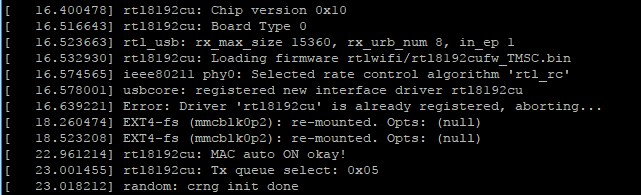

Alternative sollte das device auch unter *lsmod* auftauchen:
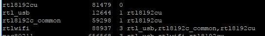

Die WLAN0 IP sollte dann via *ifconfig* angezeigt werden. Wenn nicht kann es auch sein, dass NOCARRIER gemeldet wird -> Mögliche Ursache: Der DSL Router ist zu weit weg oder die Antenne ist untauglich.

Wichtig wäre noch den **RPi PowerSave Mode** abzuschalten, weil sonst die LAN/WiFi Connection nach einiger Zeit „flöten“ geht. Dazu benötigen wir eine neue Konfig-Datei:
`sudo nano /etc/modprobe.d/8192cu.conf`

In diese tragen wir folgendes ein:
`options 8192cu rtw_power_mgnt=0 rtw_enusbss=0`

Als Letztes: Wäre eine DHCP basierte Vergabe einer IP Adresse wünschenswert (default ist static), so müssen wir die Datei **/etc/network/interfaces** wie folgt editieren: `sudo joe /etc/network/interfaces`

	auto lo
	iface lo inet loopback
	iface eth0 inet dhcp
	auto wlan0
	allow-hotplug wlan0
	iface wlan0 inet dhcp
	wpa-ap-scan 1
	wpa-scan-ssid 1
	wpa-roam /etc/wpa_supplicant/wpa_supplicant.conf
	iface default inet dhcp

Dann die individuellen Netzwerk SID + Authentication Daten eintragen: `sudo cat /etc/wpa_supplicant/wpa_supplicant.conf`

	ctrl_interface=DIR=/var/run/wpa_supplicant GROUP=netdev
	update_config=1
	network={
	        ssid="<my_SSID>“
	        psk="<my_WPA2_Key>"
	        proto=RSN
    	    key_mgmt=WPA-PSK
    	    pairwise=CCMP
    	    auth_alg=OPEN
	}

Abschließend die Änderungen an der Datei speichern und den Netzwerkdienst neu starten:
`sudo service networking restart`

Das manuelle scanning des WLAN netzes kann über  `sudo iwlist scan` forciert werden.

####Remote Konsole
Besteht nun eine dauerhafte LAN Verbindung kann auch per remote Konsole gearbeitet werden.
Das erspart die USB-Maus/-Tastatur sowie den HDMI Anschluss. Man benötigt nur noch das USB Ladekabel und den (W)LAN Zugang.
Dazu installiert man auf dem HeimPC/Laptop das Programm PUTTY.

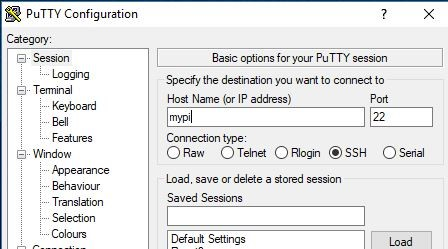

Dort fügt man im **Session** Menü nur noch die IP Adresse oder den Hostname sowie den **ssh Standard Port:22** ein und sichert den Eintrag unter einem beliebigen Namen.

Dazu wäre auch eine SSH Key Konfiguration zusätzlich sinnvoll. Die Erzeugung und Konfiguration bitte auf den einschlägigen Raspi Blogs nachlesen, da es die Session Sicherheit zusätzlich nochmal erhöht. Das weiter auszuführen würde hier aber den Rahmen sprengen.

Die Schritte nur in Kürze grob dargestellt: via raspi-config Session:
+ Create RSA Key: sudo ssh-keygen -t rsa
+ Activate SSH: sudo mv /boot/boot_enable_ssh.rc /boot/boot.rc
+ sudo reboot

Mit Drücken des Buttons *Open* startet ein Konsolfenster mit 80x24 Zeichen Größe.
**Vorteil:** über diesen Weg kann man Text per Cut&Paste a la Microsoft auf die Konsole bringen.
So sind Kommandos aus dem Internet leicht auf die Konsole zur Ausführung übertragbar.

####Samba Konfiguration
Will man unter Windows Linux Verzeichnisse öffnen benötigt man einen CIFS service wie SAMBA auf Linux Seite, per Installation via
`sudo apt-get install samba samba-common-bin`

Nach der Installation ergänzt man in der SAMBA Config Datei:
`sudo joe /etc/samba/smb.conf`

	[share]
	 comment=Raspberry Pi Share
	 path=/home/pi/share
	 browseable=Yes
	 writeable=Yes
	 only guest=no
	 create mask=0775
	 directory mask=0775
	 public=no

Im Heimverzeichnis erzeugt man dann noch das Verzeichnis: `mkdir \home\pi\share`
Für das Samba-eigene User-Verzeichnis müssen noch die User Credentials angegeben werden:
`sudo smbpasswd -a pi`
-> dazu gibt man das PI-Passwort nochmal an.

Als letztes wird der Samba Service neu gestartet: `sudo service smbd restart`
Nun sollten sie auf den Share: **\\raspberrypi\share** seitens WIndows mit den user credentials von *pi* zugreifen können.

###GPIO Programmierung
Für die GPIO Programmierung verwende ich die “WiringPi” Library.
Diese muss direkt über git-hub installiert werden:

`sudo apt-get install git-core`
`git clone git://git.drogon.net/wiringPi`
`cd WiringPi`
`./build`

Das wiringPi  GPIO-ID mapping weicht leider von der Steckerbelegung wie in der Tabelle weiter unten ersichtlich ab.

Alle ID Information werden über `#include <wiringPi.h>`
in das C programm eingebunden und über die Funktion: wiringPiSetup() initialisiert.

Die Compilierung erfolgt mit dem Zusatz: -lwiringPi

*Beispiel:* Das OneWire Daten-Protokoll wird per default via **BCM GPIO#4** geführt. 
Nach WiringPi Enumeration gilt die **ID: #7 am phys. Pin7**.
**wiringPiSetupGpio()** erlaubt aber weiterhin die GPIO BCM Enumeration auch im Code zu verwenden.

Eine detaillierte Beschreibung der WiringPi-API gibt es hier und etliche Codebeispiele für verschiedene Sprachen gibt es **[hier](http://raspberrypiguide.de/howtos/raspberry-pi-gpio-how-to/)**.

**Die WiringPi / GPIO Mapping Tabelle**
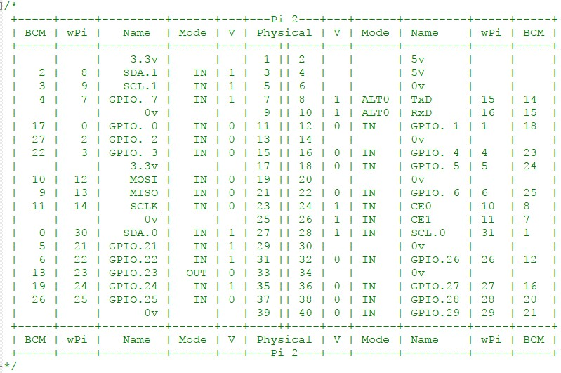

###Raspi One-Wire Modul/DeviceTree

Das Raspbian OS hat die für den 1-Wire-Bus notwendige Treiber bereits an Bord, wobei der oben erwähnte GPIO 4 Pin (WiringPi ID:7) für den 1-Wire-Bus vorgesehen ist. Wie bei allen GPIOs werden auch hier die Daten über virtuelle Dateien im Verzeichnis /sys verarbeitet, genauer in: **/sys/bus/w1**

Die 1-Wire-Unterstützung muss im Kernel als Modul nachgeladen werden (im SU Mode).
Es werden zwei Module benötigt, eines für den 1-Wire-Bus allgemein und eines für die Temperaturmessung mit dem DS1820. Also geben sie ein:
`sudo modprobe w1-gpio pullup=1`
`sudo modprobe w1-therm`

Wichtig ist der Parameter pullup=1, der besagt, dass eine parasitäre Speisung über einen Pullup-Widerstand vorhanden ist. Die Module legen im Verzeichnis /sys/bus/w1/devices mehrere symbolische Links auf Unterverzeichnisse an, zum Beispiel (Zeilen umbrochen): 

	root@raspberrypi:/sys/bus/w1/devices# ls -l
	insgesamt 0
	lrwxrwxrwx 1 root root 0 Mai 13 07:30 10-000802bf634d
	             -> ../../../devices/w1_bus_master1/10-000802bf634d
	lrwxrwxrwx 1 root root 0 Mai 13 07:30 10-000802cfb15d
	             -> ../../../devices/w1_bus_master1/10-000802cfb15d
	lrwxrwxrwx 1 root root 0 Mai 13 07:30 w1_bus_master1
	             -> ../../../devices/w1_bus_master1

Eigentlich findet alles in dem Verzeichnis statt, das über den symbolischen Link w1_bus_master1 erreicht werden kann (wie die Verweise oben zeigen). Der Name der ersten beiden Verzeichnisse setzt sich aus dem Family-Code der Sensoren und deren eindeutigen Identifikationsnummer zusammen. Sensoren vom Typ DS1820 und DS18S20 haben den Family-Code 10, DS18B20 den Code 28 und DS1822 den Code 22.

Diese Befehle laden die erforderlichen Module nur bis zum nächsten Reboot. Nach einem Neustart müssen die Treiber immer wieder neu geladen werden. Damit diese Aktivierung permanent bleibt und bei jedem Bootvorgang die Treiber automatisch geladen werden, müssen diese Aufrufe in die Datei /etc/modules eingetragen werden. Dazu werden einfach die beiden folgenden Zeilen am Ende der Datei hinzugefügt: 

	# /etc/modules
	w1-gpio pullup=1
	w1-therm

Bei anderen oder älteren Distributionen kann es möglich sein, dass noch das Modul "wire" geladen werden muss; bei mir war dies nicht nötig.

Ab Kernelversion 3.18 wird für das Einsetzen der Module, der sogenannte "Device Tree" verwendet. Ab dann wird die One-Wire-Schnittstelle in der Datei */boot/config.txt* aktiviert, indem dort zwei Zeilen eingetragen werden:

`dtoverlay=w1-gpio,gpiopin=4`

Damit wird der Pin 4 des GPIO für One Wire reserviert. Und falls noch der interne Pullup-Widerstand geschaltet werden soll ergänzend:

`dtoverlay=w1-gpio-pullup,gpiopin=4,extpullup=on`

Siehe auch das Device Tree Kapitel. 

Zur Zeit läßt der Treiber **bis zu 10 Sensoren** am Bus zu. Man habt jedoch die Möglichkeit, durch einen Eintrag in der Datei **/etc/modprobe.d/1-wire.conf** diese Zahl zu erhöhen. Falls die Datei noch nicht exisitert, ist sie neu zu erstellen. Dann kann mit der folgenden Zeile die Anzahl der möglichen Sensoren, z. B. auf 8, eingestellt werden:

`options wire max_slave_count=8`

Diese Änderung wird aber nur beim Laden des Treibers übernommen, gegebenenfalls erst nach dem nächsten Neustart.

Der Zugriff auf die Sensoren erfolgt über das Dateisystem. Sie müssen auch nicht root sein, es darf jeder User lesend darauf zugreifen. Jeder Sensor wird mit seiner ID als Verzeichnis eingebunden. Ist die Hardware angeschlossen und sind die Kernel-Module geladen, können die Temperaturwerte über eine Pseudo-Datei abgerufen werden. Wie gesagt, bekommt jeder Sensor ein eigenes Verzeichnis unter **/sys/bus/w1/devices/** (symbolische Links). 
Innerhalb des Verzeichnis eines Sensors kann die Temperatur aus der (Pseudo-)Datei **w1_slave** gelesen werden, beispielsweise durch: 

	root@raspberrypi: cat /sys/bus/w1/devices/10-000802cfb15d/w1_slave
	33 00 4b 46 ff ff 02 10 f4 : crc=f4 YES
	33 00 4b 46 ff ff 02 10 f4 t=25625

Das Ergebnis des Sensors mit der *ID 10-000802cfb15d* besteht aus zwei Zeilen, die jeweils mit der hart verdrahteten ID des Bausteins und Angaben zur Prüfinfo bzw. dem Ergebniswert enthalten.
Die erste Zeile teilt uns mit, ob die Prüfinfo korrekt war ("YES"), in der zweiten Zeile finden wir die Temperaturangabe in Tausenstel Grad (t=25625 ? 25,625 °C).
Das Datenblatt des Sensors ist leider ernüchternd, denn der Sensor misst keineswegs so genau. Vielmehr sind es beim Standard-Typ Abstufungen in größeren Schritten. Aber für weitere Berechnungen ist es einfacher, wenn man den Wert generell nur durch 1000 teilen muss.

Im Verzeichnis **/sys/bus/w1/devices/w1_bus_master1** gibt es noch einmal die Wiederholung der Verzeichnisse für alle Sensoren und etliche interessante weitere Dateien, von denen einige besprochen werden:

	root@raspberrypi:/sys/bus/w1/devices/w1_bus_master1# ls -l
	insgesamt 0
	drwxr-xr-x 3 root root    0 Mai 13 07:29 10-000802bf634d
	drwxr-xr-x 3 root root    0 Mai 13 07:29 10-000802cfb15d
	lrwxrwxrwx 1 root root    0 Mai 13 07:30 driver
    	                     -> ../../bus/w1/drivers/w1_master_driver
	drwxr-xr-x 2 root root    0 Mai 13 07:30 power
	lrwxrwxrwx 1 root root    0 Mai 13 07:29 subsystem -> ../../bus/w1
	-rw-r--r-- 1 root root 4096 Mai 13 07:29 uevent
	-rw-rw-r-- 1 root root 4096 Mai 13 07:30 w1_master_add
	-r--r--r-- 1 root root 4096 Mai 13 07:30 w1_master_attempts
	-r--r--r-- 1 root root 4096 Mai 13 07:30 w1_master_max_slave_count
	-r--r--r-- 1 root root 4096 Mai 13 07:30 w1_master_name
	-r--r--r-- 1 root root 4096 Mai 13 07:30 w1_master_pointer
	-rw-rw-r-- 1 root root 4096 Mai 13 07:30 w1_master_pullup
	-rw-rw-r-- 1 root root 4096 Mai 13 07:30 w1_master_remove
	-rw-rw-r-- 1 root root 4096 Mai 13 07:30 w1_master_search
	-r--r--r-- 1 root root 4096 Mai 13 07:30 w1_master_slave_count
	-r--r--r-- 1 root root 4096 Mai 13 07:30 w1_master_slaves
	-r--r--r-- 1 root root 4096 Mai 13 07:30 w1_master_timeout

Die Datei **w1_master_max_slave_count** enthält die maximal mögliche Zahl der angeschlossenen Sensoren (default: 10). 
Das Kommando `cat w1_master_pullup` liefert uns die Einstellung für den Pullup-Parameter des Treiberaufrufs. Drei weitere Dateien geben Auskunft über Anzahl der aktiven Sensoren ("Slaves"), den Timeout bei der Messung und die IDs dar angeschlossenen Slaves:

	cat w1_master_slave_count
	2
	
	cat w1_master_timeout
	10
	
	cat w1_master_slaves
	10-000802bf634d
	10-000802cfb15d

Die Datei **w1_master_slaves** ermöglicht recht einfachen Zugriff auf die Slaves. Dieser Weg wird auch im beelogger Programm genutzt.

Weitere Literatur-Links zu OneWire Sensoren:
+ [Guidelines for Reliable Long Line 1-Wire Networks](http://pdfserv.maximintegrated.com/en/an/AN148.pdf)
+ [1-Wire Communication Through Software](http://pdfserv.maximintegrated.com/en/an/AN126.pdf)
+ [Using the DS2480B Serial 1-Wire Line Driver](http://pdfserv.maximintegrated.com/en/an/AN192.pdf)
+ [1-Wire Search Algorithm](http://pdfserv.maximintegrated.com/en/an/AN187.pdf)

###Algorithmus: OneWire Protokoll DS1820
Hier nun ein Codeauszug in ‚C‘ zur Interpretation des OneWire Protokolls via Raspberry Kernel Module für die Temperatursensoren:

	aus beelog: get1wire.c
	 * Recommended connection (default by Wheezy kernel driver)
	 *   1-wire sensor  | Raspberry Pin | wiringPi
	 *   ---------------|---------------|---------
	 *       DATA	   |  P07 - GPIO7  | -> 7
	 *	   3.3V	   |  P01 - 3.3V   |
	 *	   GND		|  P09 - GND    |
	
	#define W1_PATH		"/sys/bus/w1/devices"
	// path to 1-wire device nodes
	#define W1_IDCOUNT_FILE "w1_bus_master1/w1_master_slave_count"	// # of OW slave
	#define W1_IDLIST_FILE  "w1_bus_master1/w1_master_slaves"	// contains OW slave IDs
	#define W1_FNAME_VAL	"w1_slave"	// W1 device node value file
	#define W1_MAX_SLAVES	64		// Max. number of served W1 slaves at 1 path
	#define W1_SLAVE_IDLEN	16			// Max. W1 slave name lenth
	#define W1_SLAVE_PATHLEN	1024		// length of w1 value file path
	#define W1TYPEDS18B20	28	// W1 Slave sensor type: ID-Byte1=28 -> DS18B20
	#define W1TYPE28NAME	"DS18B20"
	#define W1TYPEDS1822	22	// W1 Slave sensor type: ID-Byte1=10 -> DS18S20
	#define W1TYPE22NAME	"DS1822"
	#define W1TYPEDS18S20	10	// W1 Slave sensor type: ID-Byte1=10 -> DS18S20
	#define W1TYPE10NAME	"DS18S20"
	#define CELSIUS_ZU_FAHRENHEIT( t ) ( ( t ) * 1.8 + 32 )	// get ID count	

Raspberry OneWire device structure Algorithmus:

	sprintf(w1line, "%s/%s", w1devpath, W1IDCOUNTFILE);  

	// open W1 Device ID list file
	fd = fopen(w1line, "r");
    if (!fd) return NULL;

	fgets(w1line, 1024, fd); // read out first line of slave counter file
	fclose(fd);

	sscanf(w1line,"%i", &i); // assumed only one value in this file/line
	w1devidx=i;			// now we know the amount of slaves

	if(i=0)				// if no slave active exit here
	  return NULL;		 // return: no slaves detected

	// get ID list by static ID of Raspberry OW Device bridge
	sprintf(w1line, "28-041670f10bff");
	fd=NULL;

	fd = fopen(w1line, "r");		// open W1 Device ID list file
	if (!fd) return NULL;
	
	fseek (fd, 0L, SEEK_END);		// check length of file 
	if(ftell(fd) == 0)	return NULL;	// -> =0 no slaves detected
	
	fseek(fd, 0L, SEEK_SET);		// go back to start of file

	// get ID string line per device/sensor
	for(i=0; i < w1devidx && fgets(w1line, 1024, fd) != NULL; i++) {	
	// fgets reads one line at a time, up to the max size
	// but not the next block of max size.

	strncpy(w1dev[i].ID, w1line, W1SLAVEIDLEN);  // fetch ID string
	w1_dev[i].ID[W1_SLAVE_IDLEN-1] = '\0';  // assure 0 terminated string
	strncpy(w1dev[i].type, "unknown", W1_SLAVE_IDLEN);			

	// preset type name
	sscanf(w1dev[i].ID,"%i-%s", &w1type, s1);					

	// get type ID: Byte1
	switch(w1type) {
		case W1TYPEDS18B20: 
			strncpy(w1dev[i].type, W1TYPE28NAME, W1SLAVEIDLEN);
			break;
		case W1TYPEDS18S20: 
			strncpy(w1dev[i].type, W1TYPE10NAME, W1SLAVEIDLEN); 
			break;
		case W1TYPEDS1822:  
			strncpy(w1dev[i].type, W1TYPE22NAME, W1SLAVEIDLEN); 
			break;
		default: 
			strncpy(w1dev[i].type, "\0", 1); 
			break;	// unknown type
	}
	// remember path to value data file of each ID
	sprintf(w1dev[i].valpath, "%s/%s/%s", w1devpath, w1dev[i].ID,
 										W1FNAMEVAL);  
	w1dev[i].crc = 0;		// preset crc value field
	w1dev[i].tval= 0;		// preset temperature value field
	// got 1 slave id entry
	fclose(fd);


Und hier die Auswertung der OneWire Daten per Sensor:

	// parse 1-wire sensor data to value struct	
	fd = fopen(w1dev[i].valpath, "r");
	if (!fd)
		return -1;

	fgets(w1line, 1024, fd);		// get 1. data line
	// e.g.: 2d 00 4b 46 ff ff 02 10 19 : crc=19 YES
	sscanf(w1line,"%x %x %x %x %x %x %x %x %x : crc=%x %s", &i1 ,&i2 ,&i3 ,&i4 ,&i5 ,&i6 ,&i7 ,&i8 ,&i9, &w1_dev[i].crc, s1);

	if(s1 == "NO") {				// wrong CRC check
		// try again one time
		fclose(fd);
		fd = fopen(w1dev[i].valpath, "r");
		if (!fd)
			return -1;

		fgets(w1line, 1024, fd);		// get 1. data  line
		// e.g.: 2d 00 4b 46 ff ff 02 10 19 : crc=19 YES
		sscanf(w1line,"%x %x %x %x %x %x %x %x %x : crc=%x %s", &i1 ,&i2 ,&i3 ,&i4 ,&i5 ,&i6 ,&i7 ,&i8 ,&i9, &w1_dev[i].crc, s1);
        if(s1 == "NO") { 			// again wrong CRC check -> give up
			w1_dev[i].tval=0;
			w1_dev[i].crc=0;
			fclose(fd);
			return -1;	// leave this entry empty
		}
	}
	fgets(w1line, 1024, fd);		// get 2. data  line
	fclose(fd);
	// e.g.: 2d 00 4b 46 ff ff 02 10 19 t=22625
	sscanf(w1line,"%x %x %x %x %x %x %x %x %x t=%f", &i1 ,&i2 ,&i3 ,&i4 ,&i5 ,&i6 ,&i7 ,&i8 ,&i9, &w1_dev[i].tval);

	w1dev[i].tval = w1dev[i].tval / 1000; 	// got it

Die OW ID eines jeden neuen Sensors wird vom Hersteller entweder mitgeliefert, oder man muss durch Deltaanalyse der gelisteten IDs diese selbst ermitteln. Bei den mir gelieferten Sensoren wies ein Aufkleber am Kabel die jeweilige ID auf. 
Diese führe ich als Konstante in der Headerdatei auf um sie im Programmlauf zu identifizieren.
Die Messwerte eines jeden Sensors ist per CRC code gesichert und kann bei Bedarf durch einen Temperaturkoeffizienten noch mal kalibriert werden (dieser Teil fehlt hier, stellt aber nur das Produkt mit einem statischen Koeffizienten dar).
Generell gilt bei der Stockwaage: Maßgeblich sind die Relativwert-Aussagen pro Volk.

###Algorithmus: A/D Wandler HX711 Protokoll
Da die Bosche Wägezelle nur ein passives analoges Widerstandnetzwerk ist, kann der Messwert nur durch einen A/D Wandler quantifiziert werden. Je höher die Bit-zahl des Wandlers desto feiner die Messwertabstufung. Da die Wägezelle aber auch nur eine gewisse Genauigkeit aufweisen kann, ist ein zu hoher Bit-Wert überflüssig und führt nur zur Messung der Streuungswerte, denn zu einer höheren Genauigkeit.
Der HX711 ist mit seinen 24Bit für die Art Wägezelle mit Wheatstonebrücke optimiert.
(siehe Genauigkeitsrechnung zu HX711 in der Komponentendiskussion)
Weitere Hinweise dazu finden sich auch unter:  (http://www.raspberrypi.org/archives/384)
Hier nun das eigentlich Messprogramm als Auszug:

	|HX JP2 pins | Raspberry Pin | wiringPi|
	|------------|---------------|---------|
	|HX 1 - GND  |  P39 - GND    |     	|
	|HX 2 - DT   |  P16 - GPIO23 | -> 4	|
	|HX 3 - SCK  |  P18 - GPIO24 | -> 5	|
	|HX 4 - Vcc  |  P02 - 5V     |     	|
	
	// HX711 Pin control macros
	#define SCK_ON  digitalWrite(cfgini->hc_hxclkpin,1) // set HX711 SCK pin=1
	#define SCK_OFF digitalWrite(cfgini->hc_hxclkpin,0) // set HX711 SCK pin=0
	#define DT_R    digitalRead(cfgini->hc_hxdatapin)   // read HX711 DT pin

	// Initiate “Converter Reset” -> default: channel A gain 128
	pinMode(cfgini->hc_hxdatapin, INPUT);
	pinMode(cfgini->hc_hxclkpin, INPUT);
	pinMode(cfgini->hc_hxclkpin, OUTPUT);
	
	SCK_OFF;
	SCK_ON;			
	usleep(60);		// SCK =1 for >60usec will Powerdown HX711
	SCK_OFF;
	usleep(60);		// SCK = 0 again ->> reset HX711 to normal mode
	
	// Set HX711 gain:
	// r = 0 -> 128 gain ch a	-> 24+0 clocks
	// r = 1 -> 32  gain ch b	-> 24+1 clocks
	// r = 2 -> 63  gain ch a	-> 24+2 clocks
	r = 0;		// maximale Verstärkung des Analogeingangs
	
	while( DT_R );		// wait till sensor is ready
	for (i=0;i<24+r;i++) { // make a dummy read for channel selection
		SCK_ON;
		SCK_OFF;
	}
	float weight;		// final weight of hive
	float tempcomp;	  // Temp. compensation referenced calibration
					     //      temp - ext. temperature
	channel = 0;		 // Select r = 0 - 128 gain ch A
	nsamples = 30;	   // get number of reads per burst
	 
	// get the raw samples and calculate the average value	
	for(i=0;i<nsamples;i++)
		samples[i] = readcnt(channel); // read data raw from ADC (no offset)
	
	// All "nsamples" raw reads done -> calculate average value
	        tmp_avg = getaverage(samples, nsamples);
	// recalculate tempcomp here: 1 +/- compensation
	        tempcomp = gettcomp(exttemp);
	
	// calculate final weight value with all compensations
	weight = ((float) (tmp_avg - customoffset) / (float) cfgini->hxrefkg) * (float) tempcomp;
	return (weight);}

------------------------------------------------------------------------
	// Service Function: readcnt()
	//  Read out 1-wire sensor data according to 1-wire protocol
	//  Be aware: works only for 1-wire sensor connected 
	//            => no sensor selection code yet
	
	unsigned long readcnt(int channel) {
		long count;
		int i=0;
		int b=0;
		count = 0;		  // reset bit field for read data

	  while( DT_R );		// wait for DOUT 1 -> 0
		b++;				// => wait >= 0,1us
		b++;
		b++;
		b++;

	for(i=0;i<24	; i++) { // create 24 pulse <= 50us
		SCK_ON;
	    count = count << 1;  // shift bit file pointer to next bit
		b++;
		b++;
		b++;
		b++;
	    SCK_OFF;
		b++;
		b++;
	    if (DT_R > 0 ) { count++; }	// store read bit 0/1
	  } // end of read pulse burst: LSB is the last one
	
	  for(i=0; i <= channel; i++){ // create channel selection pulses
		SCK_ON;			  // 25. pulse -> set channel A(128)
		b++;				 // 26. pulse -> set channel B(32)
		b++;				 // 27. pulse -> set channel A(64)
		b++;
		b++;
		SCK_OFF;
		b++;
		b++;
		b++;
		b++;
	  }
		if (count & 0x800000) {	// mask data field
			count |= (long) ~0xffffff;
		}
	  return (count);	// return final bit field as data
	}

###Die Hauptprogrammstruktur
Das Programm Binary: BeeHive muss immer als User: root gestartet werden (wg. wiringPI GPIO Zugriffen):
`sudo beehive &`

Der interne Programmfluss sieht wie folgt aus:
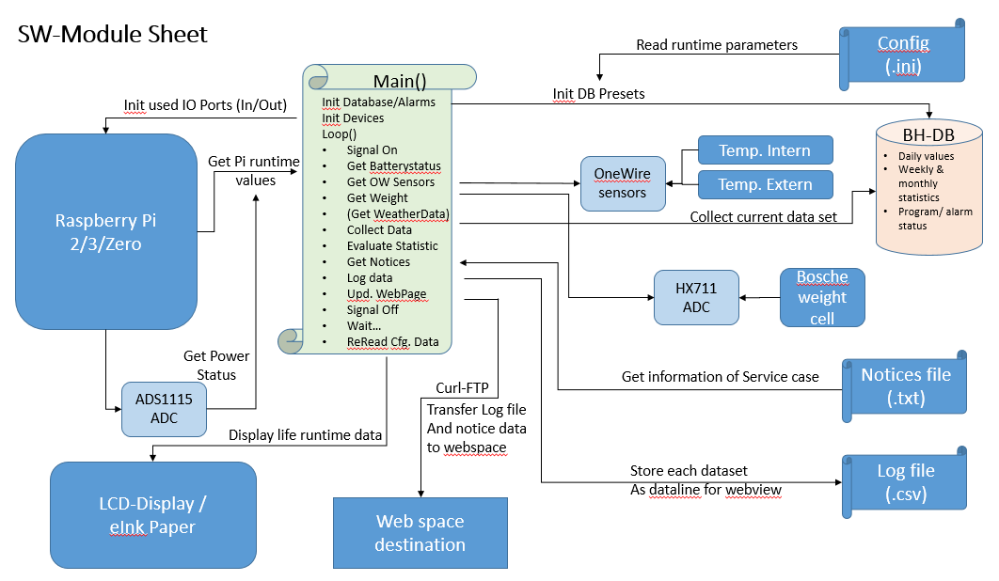

**Main()** Struktur:
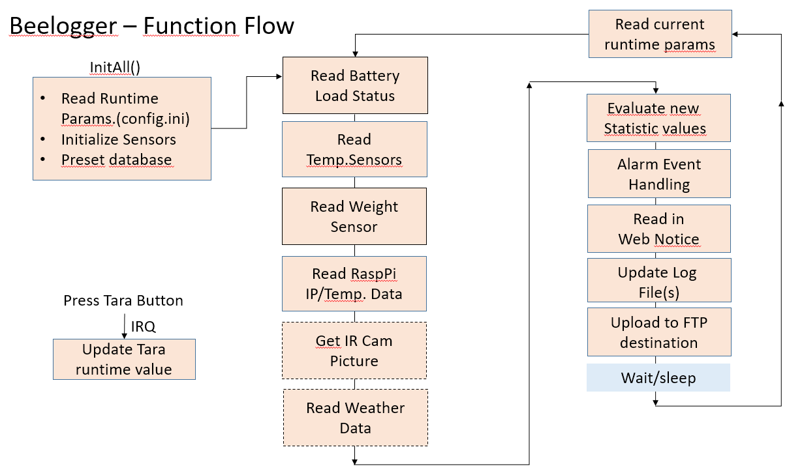

1. **Initall()**	Initialisiere alle Devices/Services
	+ **Getini()**: 	Einlesen der Programm Runtime Betriebsparameter (aus config.ini)
	+ **WiringPiSetup()**: OW System Initialisierungs Funktion (definiert in wiringPi.h)
	+ **Getw1list()**: 	Suche nach allen existierenden OW Sensors aus dem OW device tree
	+ **InitHX711()**:	Initialisiere/Reset HX711 A/D Wandler
	+ **InitBHDB()**:	Initialisiere beehive interne Datenhaltung für Statistik Analysen
	+ Rücksetzen aller Alarm-Semaphoren
2. Globale Endlosschleife aller Messungen und Auswertungen
	+ Prüfe Batteriespannungswerte -> ggfs. Alarm auslösen
	+ *Auslesen aller OW Sensor	 pro ID	(s. Kapitel: OW Algoithmus)*
	+ *Auslesen aller Bosche Wägezellen	(s. Kapitel: HX711 Algorithmus -> GetHX711() )*
	+ Update BeeHive interne DB mit allen Messwerten
	+ **DataCal()**: Validiere die Messwerte nach Grenzwerten/Ranges und filtere/dämpfe Störwerte
		* Optional: Statistikermittlung Wochen-/Monatsweise
	+ **MyAlarm()**: Prüfe aufgelaufene Alarmmeldungen und reagiere entsprechend
	+ BeeCSV(): Speichere alle Werte in einer lokale CSV Datei zur externen Weiterverarbeitung
	+ Optional:
		* PutStartScreen() Update mit aktuellen Messwerten
		* WebUI(): Transferiere alle Messdaten zu einer User Webpage zur Anzeige 
			* Export(): per FTP, email, URL copy path
	+ *Warte nun N Minuten (default: 10Min)*
	+ Ev. geänderte Runtime Betriebsparameter neu einlesen
		* **Getini()**: Einlesen der Programm Runtime Betriebsparameter (aus config.ini)
	+ **GetNotice()** Bearbeitung eingetroffener Servicekommentare vom User/WebUI
3. Loop End (loopcounter +1)

Zur Initialisierung der Betriebs-Konfigurationskennwerte des BeeLog Programms dient eine Konfigurationsdatei: **./config.ini**.
Diese ist im Windows klassischen INI-Format strukturiert und wird im root-Folder der Programm-binaries erwartet.
Kann sie nicht gefunden werden, wird sie vom Programm mit default Werten neu erzeugt. Eine Anpassung durch den Anwender ist dann aber noch notwendig, um die Pfad- oder Benutzerangaben sinnvoll zu definieren. Die Grundstruktur liegt damit aber schon mal vor:
Die farbigen Parameter müssen unbedingt überarbeitet werden bevor das Programm Beehive neu gestartet wird:

	; BeeHive Logger config file for initialization 
	; 03.01.2019
	VERSION	= 2.2
	; Beehive tool configuration runtime parameters
	; This file can be modified during runtime of beehive !
	; All Values are parsed cyclic during runtime right after the wait loop.
	
	[HWCONFIG]                 ; wPi-GPIO configuration settings (BCM GPIO#)
	PINHX711DT = 23            ; J8.P16: HX711 DT  dataline
	PINHX711CLK= 20            ; J8.P38: HX711 SCK clockline (SPI1 MOSI)
	PINADSALERT= 22            ; J8.P15: ADS ALERT/RDY GPIO22
	PINTESTLED = 12            ; J8.P32: TEST LED (red) /w ext. pullup
	PINTARABT  = 16            ; J8.P36; TARA Reset ISR trigger Button
	PINOWIOPIN = 4             ; J8.P07: OneWire dataline -> claimed by kernel cfg files

	; Display: WaveShare 2.7" ePaper HAT (DISPLAY =1) SPI0 => wPi setup with GPIO#
	EPAPERDIN  = 10            ; J8.P19 SPI0-MOSI GPIO10
	EPAPERCLK  = 11            ; J8.P23 SPI0-SCLK GPIO11
	EPAPERCS   = 8             ; J8.P24 SPI0-CE0  GPIO08
	EPAPERDC   = 25            ; J8.P22 GPIO25
	EPAPERRST  = 17            ; J8.P11 GPIO17
	EPAPERBUSY = 24            ; J8.P18 GPIO24
	EPAPERKEY1 = 5             ; J8.P29 GPIO05
	EPAPERKEY2 = 6             ; J8.P31 GPIO06
	EPAPERKEY3 = 13            ; J8.P33 GPIO13
	EPAPERKEY4 = 26            ; J8.P37 GPIO26
	; Component enabler
	GPSMOUSE   = 0             ; =1 GPS mouse connected -> part of logdata
	THERMOCAM  = 0             ; =1 Thermo camera connected >0: save pics each x min.
	THERMOLOOP = 10            ; Wait time for thermo pic creation in minutes
	BEECOUNTER = 0             ; =1 BeeCounter connected -> part of logdata
	DISPLAY    = 1             ; =1 Activate local display update => =1 for WaveShare ePaper 2.7"
	WEBUI      = 1             ; =1 Activate Webpage date preparation at BEELOGWEB
	
	[BEELOG]   ; Init of Main Programm
	BHLOOPWAIT = 600           ; loop wait time in Sec. (600 = 10Min.)
	BEELOGHOME = /home/pi/share/beelog  ; Home path for beelog housekeeping data
	LOGFILE	   = beelog.txt ; log file name (/w extension)
	CSVFILE    = beelog        ; *.csv data log file name (/wo extension)
	CSVDAYS    = beedays	   ; *.csv file of daily statistic summary (/wo extension)
	ACTIOFAIL  = 1             ; allowed action on IO Error: 0= no Action, 1= exit, 2=reboot
	VERBOSE	   =  1         ; verbose levels +1:main flow + 2=1-wire + 4+8=hx711(lev 1+2)
	                           ; 16=Import/export + 32=Web Update + 64=raspimon
	                           ; +128 = statistic data calculation 
	[HX711]   ; Init of Weight scale ADC
	TARA       = 823500        ; Calibration for 0 kg                         
	TARARESLOCK= 0             ; =0 TARA reset button is disabled, =1 enabled  
	TARARESET  = 0             ; =0 TARA Button active; =1 TARA Button simulated
	REFKG      = 46350         ; weight scale reference value of 1kg
	HXSPREAD   = 10            ; trust range of weight scale +/- 5% = 10 per measurement
	DATSPREAD  = 10            ; trust range of weight scale +/- 5% = 10 between 2 measurements
	TEMPCOMP   = 0.9           ; Temp. compensation factor per Grad           
	NSAMPLES   = 10            ; Number of read loops for average calculation 
	                           ; Max Range: 2..100
	[ONEWIRE]  ; Init of One-Wire devices
	OWFILEPATH  = /sys/bus/w1/devices ; path to one wire filesystem of kernel driver
	OWTEMPINTID =  28-012345678900  ; OW ID of DS18B20 sensor at Bosche cell
	                                ; -> also used as Weight scale unique identifier
	TEMPCINT    =  0.00             ; temperature compensation Internal sensor
	OWTEMPEXTID =  28-012345678900  ; OW ID of DS18B20 sensor to get externa1 temperature
	TEMPCEXT    =  0.00             ; temperature compensation External sensor
	OWTEMPHIVE1ID= 28-012345678900  ; OW ID of DS18B20 sensor into first beehive
	TEMPCHIVE1  =  0.00             ; temperature compensation Hive1 sensor
	OWTEMPHIVE2ID= 28-012345678900  ; OW ID of DS18B20 sensor into sec. beehive (optional)
	TEMPCHIVE2  =  0.00             ; temperature compensation Hive2 sensor
	[WEBUI]
	BEELOGWEB   = /var/www/beelog   ; root path to webserver home of beelog for log & data files
	BEEKEEPER   = 'UserName'        ; Full name of Owner/User/BeeKeeper
	LOCDAT1     = '-Garten-'        ; Location of BeeHive1
	LOCDAT2     = 'Strasse'         ; Street
	LOCPLZ      = 'PLZ'             ; ZIP code of location (also fro weather data from web)
	LOCDAT3     = 'Ort'             ; location name
	PICSMALL    = BeeLog_Picture_compressed.jpg ; Pic of BeeHive (compressed) used as WebLogo
	PICLARGE    = BeeLog_Picture.jpg ; Pix of Beehive full size
	AUTOUPDATE  = 0                 ; init automatic update of website
	WEBDEFFILE  = index.html        ; default Web index file to be updated
	NOTICEFILE  = beenote.txt       ; text file of service notices for logging
	ALARMON     = 0                 ; =1 Global 'ALARM enabled' for security/events
	ALARMWEIGHT = 0                 ; Alarm on Weight change > 50% in 5 seconds: thieve
	                                ; =0 disabled, 1..99% enabled, typical 50(%)
	ALARMSWARM  = 0                 ; Alarm on weight change > 10% in 10 minutes: swarm
	                                ; =0 disabled, 1..99% enabled, typical 10(%)
	ALARMBATT1  = 0                 ; =0 disabled; 1..99% enabled, typical 98(%)= 4.9V
	ALARMBATT2  = 0                 ; =0 disabled; 1..99% enabled, typical 95(%)= 4.75V
	
	[EXPORT]
	EXFTPURL    = <ftp URL>         ; FTP site URL for upload of raw logger data from BEELOGWEB
	EXFTPPORT   = 21                ; Portnumber of URL (used as string)
	EXFTPPATH   = imkerei/beelog    ; relative FTP path to URL
	EXFTPPROXY  =                   ; If needed: FTP proxy server; set '' if no proxy needed
	EXFTPPROXYPORT =                ; used proxy port (used as string)
	EXFTPUSER   =                   ; no user name for FTP access 
	 				 (get pwd by dialogue or local .netrc file using pwd encryption)
	BKUPPATH    = **/home/pi/share/beelog** ; Backup file path (local or remote)
	BKUPFILE    = beelog.bak            ; name of config/log backup file at BKUPPATH
	
Die rot markierten Parameter müssen aktualisiert werden:
	* BEELOGHOME	Pfad auf das Ablaufverzeichnis des Programms
	* BEELOGWEB	 Der Pfad dient auch der allg. CSV Datenfile und Logfile Ablage
	* TARA		  Messwert der Waagezelle bei 0kg (abh. vom WaagenDeckel Eigengewicht)
	* REFKG         Delta-Messwert der Waagezelle bei +1kg
	* OWTEMPINTID, OWTEMPEXTID, OWTEMPHIVE1ID
	 			   OneWire Unique ID Temp-Sensor strings (DS18x20 = 28-xxxxxx)
	* OWTEMPHIVE2ID	2. Beuten Temp.Sensor und die jeweiligen Kalibrierungswerte sind optional
	* BKUPPATH    	 Pfad für Backup Datenablage (optional)

Alle grün markierten Parameter sind zu aktualisieren, wenn man AUTOUPDATE  = 1 setzt, und damit 	den Web folder update aktiviert. Dann fallen noch folgende Werte zum update an:
	* BEELOGWEB   Pfad auf das WWW Verzeichnis welches vom Webservice 
	 	     	per index.html Datei angezeigt wird. (z.B. Apache2: /var/www/…)
	 			 Der Pfad dient auch der allg. CSV Datenfile und Logfile Ablage
	* BEEKEEPER, LOCDAT2, LOCPLZ, LOCDAT3  -> Angaben zur Person des Imkers
	* PICSMALL, PICLARGE   				->  Bilder z.B. der Stockwaage & Beute
	* EXFTPURL	Netz Pfad auf den FTP server eines externen providers
	 			 Authentication Daten sollten per .netrc Datei platziert werden. 
	* EXFTPPATH   Pfad relative zum FTP root des ext. Web Proiders
	* AUTOUPDATE =1 -> Web- und FTP folder wird mit Daten versorgt

###Kalibrierung der Waage
Nach dem Aufbau und erstem Einschalten wird die Waage noch wilde Werte anzeigen, weil der 0kg Bezug noch nicht festgelegt wurde. Dazu dient folgende Vorgehensweise:

1. Config.ini: TARARESLOCK =1	setzen (TARARESLOCK bleibt =0)
2. Config.ini: BHLOOPWAIT = 6	setzen -> Messwert alle 6 Sekunden
3. Config.ini: Verbose = 1	setzen -> Messdatenausgabe auch auf Konsole
4. Stockwaage ohne Gewicht an Stromquelle anschliessen (POE LAN Kabel, PV, Batterie, USB Port)
5. Messwert auslesen und in config.ini: TARA= eintragen. (z.B. bei mir sind es 36000 da mein Waagendeckel alleine ca. 6,5 Kilo hat. Das wird bei jedem Aufbau stark schwanken je nach Materialien)
	+  Sofort Test durch drücken des TARA Buttons möglich, der bei jeder loop abgefragt wird.
	+ -> Tara-Wert wird sofort vom Programm berücksichtigt.
6. Config.ini: TARARESLOCK =0 setzen (TARARESLOCK bleibt =0)
7. 1kg auflegen
8. Deltawert zu 0 kg in Config.ini: ‚REFKG=‘ angeben. 
	Dadurch wird die Gewichtskurvensteigung auf den 0kg Punkt eingestellt.

Ab jetzt sollte die Waage richtige Messwerte anzeigen. Der 1kg Wert kann auch durch das eigene Körpergewicht ermittelt werden:
-> Aufsteigen, und Deltawert durch bekanntes Körpergewicht als REFKG angeben.

**Vorteil**: Der Messfehler ist um die Anzahl Kg des Körpergewichts kleiner als nur bei 1 kg.

**TARARESLOCK** dient zur Simulation des TARA Buttons, wenn man mal bei aufgestellter Beute den TARA Wert remote neu einstellen will (z.B. für reine Deltamessung einer Beute, ohne Vorort gehen zu müssen um den TARA Taster zu drücken.)  -> **TARARESLOCK** setzen und bei nächstem Schleifendurchlauf wird TARA für akt. Eigengewicht der Waage incl. allem was drauf steht neu eingestellt.

Da man massgeblich nur an den relativen Messwerten z.B. zur Diagrammdarstellung interessiert ist, ist derartige Kalibrierung nur einmal bei der Erstaufstellung nötig. Danach reicht die relative Aussage als Messkurve.

###Restart via Crontab
Gibt es mal Störungen, sei es aus dem Programm selbst (nicht korrigierbarer Fehlerpfad) oder von ausserhalb (Spannungs-Drop) ist manchmal ein Restart unvermeidlich.
Via Crontab kann das Programm BeeHive automatisch beim Booten als Hintergrundjob gestartet werden: 
Das Einstellen des automatischen Programmstarts nach jedem reboot erreicht man durch:
`sudo crontab –e`

Ergänzung am Ende der angezeigten Datei: `@reboot /root/startbh`

Das benötigte Restart-Script: **/root/startbh**:

	#! /bin/sh
	PATH=/home/pi/share/beelog
	USER=root
	cd $PATH
	echo hallo >> ausgabe.txt
	$PATH/beehive &
	echo bhdone >> ausgabe.txt

Die Ablage der 
+ Steuerdatei: 	**/home/pi/share/beelog/config.ini**
+ Program: 		**/home/pi/share/beelog/beehive**
… immer mit root Ausführungsrechten: *chmod 755 startbh* und *chown root startbh*


###Optional: WebUI Daten Service
Will man Messergebnisse aus der CVS als Webpage darstellen (z.B. via Dygraph library) bietet sich als HTTP Service standardmäßig der Apache 2 Webserver an:

Apache 2 Webserver installieren:
1. sudo apt-get update
2. sudo apt-get install apache2
3. Test: http://localhost:80
4. WebHome: /var/www/html 	(Apache 2 default)
5. Server Configuration: /etc/apache2/ports.conf

Website Passwortschutz einstellen: (siehe auch: http://peter.liscovius.de/tech/htaccess/)
1. Joe /var/www/html/website1/.htaccess
2. **Add:**
	AuthType Basic
	AuthName "Zugriff verweigert - Bitte User und Passwort eingeben"
	AuthUserFile /var/www/html/website1/.htpasswd
	Require valid-user
3. Chmod 644 /var/www/html/website1/.htaccess
4. Erzeuge eine htpasswd(2):
	htpasswd -c /var/www/html/website1/.htpasswd benutzer1
	Für weitere Benutzer:
	htpasswd /var/www/html/website1/.htpasswd benutzer2

##WebUI ToDo - Liste
###Ideen-Liste
für eine WebUI Erweiterung (Farbig markierte Vorschläge sind in v1.3 schon umgesetzt):
+ ==Header==
	* Standortangaben zur Beute: -> Headline
		- ==Bild==
		- Standortname Strasse, PLZ, Wegbeschreibung
		- ==Inhaber/Imkerangaben== + Adresse
		- Waagen Unique ID
	* ==Startkonfiguration der Beute zu Messbeginn==
	* Wann letztes Daten-update: Datum & Uhrzeit
	* Besuchszähler: siehe auch [www.andyhoppe.com](http://www.andyhoppe.com/)
+ ==5-Tages Wettervorhersage pro Standort==
	* [**==Holzkirchen Wetterstation==**](http://wetterstationen.meteomedia.de/?station=109680&wahl=vorhersage)
	* DWD joomla plugin -> ftp update
	* ==Varroawetter-Link: Bsp.:==
		- [==**Otterfing**==](http://www.bienenkunde.rlp.de/Internet/global/inetcntr.nsf/dlr_web_full.xsp?src=UK532RPP90&p1=title%3DOtterfing%7E%7Eurl%3D%2FInternet%2FAM%2FNotesBAM.nsf%2FABC_Imker_RLP%2F26E7CFEF10EF5FD5C12574E40023B052%3FOpenDocument&p3=D2KEU5C709&p4=XF10F330RV)
+ ==Tages Min/Max Werte: mit Uhrzeit==
	* ==Gewicht absolut==
	* ==Gewicht Tagesdelta==
	* ==Temp. Min/Max==
+ ==Aktuelle Moment-Werte (aktualisierbar)==
	* ==Aussen-Temperatur==
	* ==Luftfeuchte==
	* ==Beutentemperatur==
	* ==Gesamt-Gewicht==
+ Messwerte Diagramm
	* Mit Tag Nacht Schattierung
	* 2-Tagesfenster:
		- ==Gewicht, Beutentemp. + Aussentemperatur + Luftfeuchte==
	* ==Auswertung mit Monatsfenster (zoombar per button)==
		- ==Temperaturfenster Min/Max pro Tag==
		- ==Gewichtsdelta / Tag==
		- Trendkurve für Gew. + Temp.
		- ==Oder Zeitfenster der Ausgabe einstellbar==
		- ==Aktionsnachricht an Messpunkt einblenden==
	* ==Gewichtsverlauf vertikal (- links <-> rechts +)==
		- ==Horizontal scrollbar an rechter/linker Seite mit Datum & Uhrzeit==
+ Arbeitspage für Völkerdurchsicht
	* Historie der zuletzt durchgeführten Arbeiten -> E-Stockbuch ?
	* Notizenfenster für aktuell geplante Arbeit
		- Bausteine als Listbox
	* Als elektronisches Stockbuch exportierbar/druckbar
	* Jahresstockbuch über alle Völker -> scrollbar
	* Tablet-tauglich
+ ==Konfiguration von Waagen Betriebsparameter -> config.ini File==
	* ==Rekalibrierungsfunktion von Waage und Temp-Sensoren (online ?)==
+ ==Export/Importfunktion==
	* ==aller Mess-/Log Daten==
	* ==Konfigurationseinstellungen==
	* ==Auto mirroring aller Daten auf remote server / backupPfad==
+ Alarm-/Diebstahlfunktion
	* GPS Sensordaten
	* Kombiniert mit Gewichtssprüngen
	* ==Batterie-/PowerSource Alarm==
	* Schwarmalarm ?
	* -> email / SMS ?
+ Thermobild Analyse -> kein Öffnen nötig
	* Best. Volksstärke
	* Sitz
	* Temperaturzustand
+ BeeCounter ?
+ 7.2Ah Blei Gel Akku (Panasonic)

##ToDo: Optional HW Module

Wettervorhersage tool: `sudo apt-get install weather-util`
Flughafen München „Franz Josef Strauß“ (IATA-Code: MUC, ICAO-Code: EDDM)
Test with `Weather eddm`

Daten-Transfer und Web Anbindung per GSM Module

Bienen-Stock Aussen-Kamera mit IR: Zur Kontrolle des Volkssitz im Winter

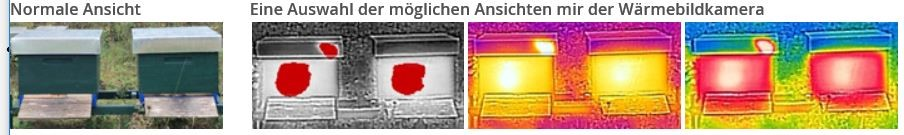

Weitere interessante Messwerte
+ Luftfeuchtigkeit (Grundkonfiguration)
+ ==Außentemperatur (Grundkonfiguration)==
+ ==Temperatur innerhalb der Bienenstöcke==
+ Niederschlagsmenge
+ Luftdruck
+ Windstärke
+ Einbruchalarm
+ Spannungsüberwachung der eingebauten Batterie
+ Spannungsüberwachung der externen 12V Batterie

Farbig markierte Vorschläge sind in der aktuellen Programmversion v1.3 bereits enthalten.

###Nutzung einer SIM-Karte
Aus: [**Imker-Stockwaage.de**](http://www.imker-stockwaage.de/hardware/simkarte)

==Um einen optimalen Empfang auch während der Wanderung zu nutzen und nicht immer verschiedene SIM 	Karten zu verwenden habe ich folgende Seite gefunden, die auch eine Prepaidkarte anbietet.
Es handelt sich um eine SIM, die sich in alle Netze einwählt, je nach Standort.
Einfach mal anschauen, sie hat viele Vorteile, funktioniert in ganz Europa und die Kosten liegen 	bei monatlich bei ca 1,20€, bei Nichtnutzung kostet diese nichts.
==

Siehe auch unter: *http://www.kasmocom.de*
	und suchen dort unter: [**M2M PrePaid-SIM**](http://www.kasmocom.de/?p=2137)
Ansonsten kann jede Prepaid-SIM verwendet werden.
Es gibt auch kostenlose SIM´s mit kostenlosem Datenvolumen.
Für die BeeIoT Lösung ist eine NB-LTE(IoT)SIM nötig.

##Quellen/Links
###Marktübersicht professioneller Bienenstockwaagen
Professionelle Anbieter digitaler Bienenstockwaagen in der EU:
* BeeWatch (Biene & Natur GmbH)
* BeeWise (aus Frankreich, Hersteller nicht erkenntlich)
* Capaz Bienenwaage (CAPAZ GmbH)
* Funk Bienenstockwaage (WE GRO Engineering)
* GSM-Monitor der Bienenstöcke (Vorlon Technology ltd.)
* Kaptármérleg (auf Ungarisch)
* Livelco (Livelco sp. z o.o.)
* Optilog-b (Borntraeger GmbH)
* Penso Bienenstockwägesystem (Emsystech Engineering)
* SMS Cebelar (aktuell nur auf Slowenisch; verwendet die JShip-Plattform und ist daher nur für den Einsatz in geschützten Umgebungen zu empfehlen)
* Wolf Waagen (Wilhelm Wolf e.K.)
* XLOG bee (Micro El)

Weitere Bienenstockwaage-Projekte im Eigenbau (Hobby- und Open Source-Projekte):
* Beelogger (Arduino)
* Fighting with Technology: Beehive scale build details (auf Englisch; Arduino)
* Hackerbee.com (auf Englisch, work in progress)
* Imker-stockwaage.de (Arduino)
* Mois-Blog Bienenwaage (Arduino)
* OpenBeeLab (auf Französisch)
.
.


Das war es soweit erstmal von meiner Seite.

Viel Spass damit und einen Imkerlichen Gruss
wünscht euch 

Randolph Esser


[**www.RandolphEsser.de**](http://www.RandolphEsser.de/Imkerei)
==> Imkerei
